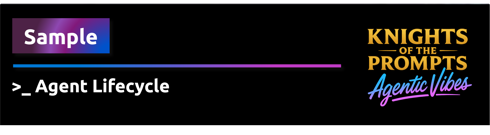

<div align="center">
    
</div>

# Accountable Agents — Part 5: Agent Lifecycle Management

**Governed lifecycle gates for operating, reviewing, remediating, restricting and retiring enterprise agents**

The earlier samples in this series created value, cost, reporting and control-plane signals for enterprise AI agents. This sample shows how those signals can influence the lifecycle state of the agent itself. It is intentionally minimal — no dashboards, no automation — and produces a single **Lifecycle Decision Package** as Markdown and JSON output.

> A control plane becomes useful when its decisions change the lifecycle of the agents it governs.

---

## Series

| Part | Sample | Core question |
|------|--------|---------------|
| 1 | [Value Attribution](../create-outcome-aware-agents/) | What value did the agent contribute? |
| 2 | [Cost Attribution](../create-cost-attribution-for-agents/) | What did it cost to create that contribution? |
| 3 | [Agent Reporting](../create-agent-reporting/) | Who needs to see the signals? |
| 4 | [Control Plane](../create-persona-aware-control-plane/) | How do signals become governed decisions? |
| **5** | **Agent Lifecycle Management** | **What happens to the agent next?** |

---

## How it works

```
Agent profile
+ Live Azure evidence
+ Lifecycle policy
= Lifecycle Decision Package
```

Given an agent profile, live Azure CLI evidence and a lifecycle policy, the sample evaluates three gates and recommends a lifecycle action. No logic is hidden; the decision function is plain Python.

---

## What this sample demonstrates

The sample evaluates whether an agent should:

- **Operate** — all gates pass; agent continues as-is
- **Review** — no associated Azure resources found
- **Remediate** — required metadata or resource tags are missing
- **Restrict** — high-risk Azure Advisor findings warrant action
- **Retire** — agent is no longer needed *(manual decision, outside this sample)*

> **Why is Scale not included?** Scaling requires real usage and value signals — evidence that the agent is delivering measurable outcomes and that demand justifies expansion. Without those signals, a scale recommendation would be a guess. This sample intentionally omits Scale until such evidence is available from Parts 1–3 of the series.

---

## What this sample does NOT do

This sample is intentionally minimal:

- **No dashboard** — output is Markdown and JSON files
- **No workflow engine** — decision logic is plain Python
- **No synthetic Azure resources** — evidence comes from real Azure CLI output
- **No fake runtime telemetry** — if no Azure data is available, the sample warns honestly
- **No automatic remediation** — the sample only recommends; it does not act
- **No production lifecycle system** — this is a decision pattern demonstration

---

## Lifecycle Decision Package

After evaluation, the sample writes two files to `outputs/`:

- `outputs/lifecycle-decision-package.md` — human-readable summary for governance reviews
- `outputs/lifecycle-decision-package.json` — structured data for integration with reporting tools

---

## Run locally

> **Before running:** update `agent_profile.yaml` with your Azure resource group and owner details, and tag at least one real Azure resource with `agent_id`, `agentName`, or `accountable_agents_demo: "true"`. Without a matching resource the sample will produce an honest `under_review` result and list collection warnings instead of fabricating data.

```bash
cd src/samples/create-agent-lifecycle-management
pip install -r requirements.txt
python agent-lifecycle-example.py
```

---

## Walkthrough — example output

The following output was produced against a real Azure resource group containing a Microsoft Foundry deployment. No tags had been added to associate resources with the Contoso Sales Agent.

### What the sample checked

The sample ran three gates in sequence:

| Gate | What was checked | Result |
|------|-----------------|--------|
| **Metadata gate** | Are `owner_email`, `sponsor_email`, `business_stream`, `expected_outcome` and `cost_center` set in `agent_profile.yaml`? | ✅ Pass — all fields present |
| **Azure resource gate** | Does at least one resource in the resource group carry a tag matching `agent_id`, `agentName`, or `accountable_agents_demo='true'`? | ❌ Fail — no matching resources found |
| **Risk gate** | Does Azure Advisor report any high or medium findings for this resource group? | ⚠️ Warning — 2 medium findings (Private Link, network access) |

### How the decision was reached

The decision rules are applied in priority order:

1. Risk gate did **not** fail (medium findings only → warning, not fail) → no Restrict
2. Metadata gate passed → no Remediate from metadata
3. Azure resource gate **failed** with zero resources found → **Review**

Because there were no associated resources, the sample cannot confirm the agent is operating correctly or that its Azure footprint is compliant. The recommended state is `under_review` until at least one resource is tagged.

### Example Lifecycle Decision Package

This is the `outputs/lifecycle-decision-package.md` file generated by the run:

```markdown
# Lifecycle Decision Package

*Generated: 2026-06-08 13:09 UTC*

## Agent

- **Name:** Contoso Sales Agent
- **Agent ID:** contoso-sales-agent-v1
- **Owner:** owner@example.com
- **Sponsor:** sponsor@example.com

## Decision

- **Current state:** operating
- **Recommended action:** Review
- **Recommended state:** under_review

## Gate Results

| Gate | Status | Message |
|---|---|---|
| metadata_gate | pass | All required profile fields are present. |
| azure_resource_gate | fail | No Azure resources were found that are associated with this agent. Tag at least one resource with agent_id, agentName, or accountable_agents_demo='true'. |
| risk_gate | warning | 2 medium-impact Azure Advisor finding(s) noted. |

## Required Actions

- Associate at least one Azure resource with this agent by adding a matching tag (agent_id, agentName, or accountable_agents_demo='true')
- Review medium-risk Advisor recommendation: Microsoft Foundry resources should use Azure Private Link
- Review medium-risk Advisor recommendation: Microsoft Foundry resources should restrict network access

## Explanation

No Azure resources were found that are associated with this agent. Tag at least
one resource with agent_id, agentName, or accountable_agents_demo='true'.
2 medium-impact Azure Advisor finding(s) noted.
1 Azure evidence collection warning(s) noted.
```

### How to move from Review to Operate

Tag at least one existing Azure resource in the resource group to associate it with this agent:

```bash
az resource tag \
  --ids <resource-id> \
  --tags accountable_agents_demo=true

# Then re-run:
python agent-lifecycle-example.py
```

Once a resource is found and all required tags are present, and no high-risk Advisor findings exist, the recommended action will change to **Operate**.

</details>

---

## How to configure `agent_profile.yaml`

Before running the sample, open `agent_profile.yaml` and update:

- `agent_id` — unique identifier for the agent
- `owner_email` / `sponsor_email` — accountability contacts
- `azure_resource_group` — the Azure resource group that contains the agent's resources
- `required_resource_tags` — the tags your organisation requires on all AI agent resources

The sample uses these values to query live Azure resources and evaluate compliance gates.

---

## What live Azure data is used

| Data source | Azure CLI command | Purpose |
|-------------|------------------|---------|
| Resource list | `az resource list --resource-group ...` | Find agent-related Azure resources |
| Resource tags | Included in resource list output | Check required tag compliance |
| Advisor recommendations | `az advisor recommendation list ...` | Identify risk findings |

---

## What to do when no resources are found

If no Azure resources are found for the configured resource group:

1. Confirm `azure_resource_group` in `agent_profile.yaml` is correct.
2. Confirm you are logged in: `az login`
3. Confirm the resource group exists: `az group show --name <resource-group>`
4. Add the tag `accountable_agents_demo: "true"` to at least one resource to associate it with this agent.

The sample will not invent resources. It will report `under_review` and list warnings.

---

## Limitations

- This is **not a production lifecycle management platform**.
- It does **not automatically change agent state** in Agent 365, Azure AI Foundry, or any orchestration platform.
- It does **not automatically remediate** Azure resources (add tags, update policies, etc.).
- It **only demonstrates the lifecycle decision pattern** using real Azure evidence.
- It **intentionally avoids mock runtime data**. If Azure data is unavailable, the sample reports warnings rather than fabricating results.

---

## Tests

```bash
pytest tests/
```

Tests use in-memory data only and do not call Azure.
