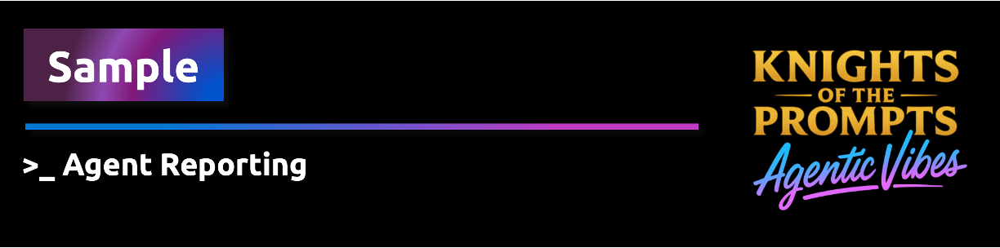
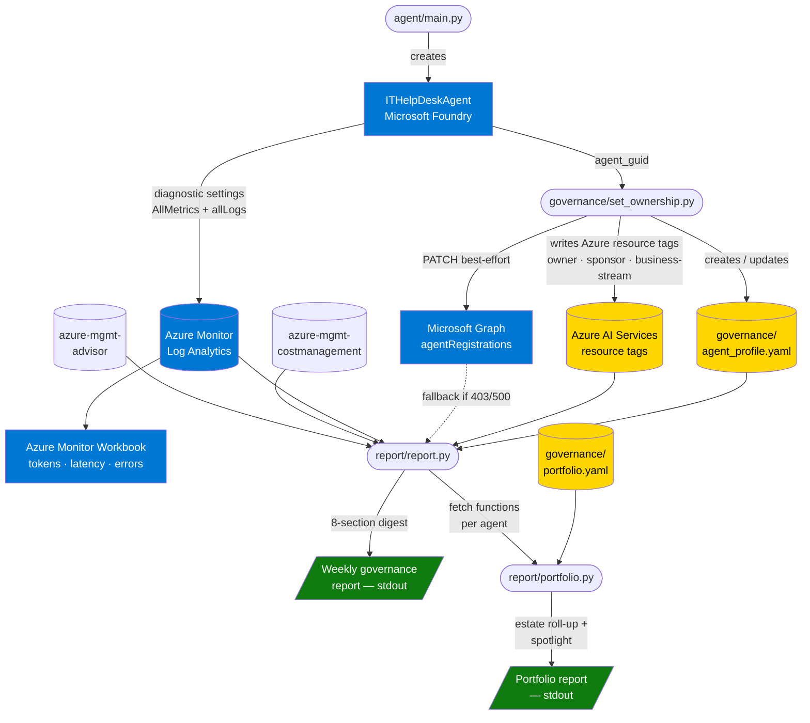

<div align="center">
    
</div>


This sample demonstrates how to create an Microsoft Foundry agent and govern it using **Agent 365** — the Microsoft 365 admin center's agent registry and lifecycle management capability.

You will:

1. Deploy an **IT Help Desk FAQ agent** in Microsoft Foundry
2. Discover the agent in the **M365 admin center** (Agents › Registry)
3. Assign an **Owner and Sponsor** via the Microsoft Graph API
4. Deploy **Azure Monitor** infrastructure to collect metrics and view a governance dashboard
5. Run an **on-demand governance report** covering usage, cost, risks, and Azure Advisor findings

---

## How it works



---

## Architecture

```
Microsoft Foundry
  └─ ITHelpDeskAgent  ──────────────────────────────────────────────────┐
       │                                                                │
       │  agent_guid (Entra agent ID)                                   │
       ▼                                                                │
Microsoft Graph                                                         │
  └─ PATCH /beta/copilot/agentRegistrations/{agent_guid}                │
       Owner, Sponsor                                                   │
                                                                        │
Azure Monitor  ◄──── diagnostic-settings (AllMetrics + allLogs) ◄───────┘
  └─ Log Analytics workspace
  └─ Application Insights
  └─ Workbook  (tokens · latency · requests vs errors · Advisor)

governance/agent_profile.yaml
  ├─ Owner (email), Sponsor (email), Business stream
  ├─ Environment, Registration source, Deployment context
  ├─ Efficiency value, Outcome value descriptions
  └─ Outcome contribution description

report/report.py  (single-agent digest)
  ├─ Graph API              → Owner, Sponsor (with profile fallback)
  ├─ agent_profile.yaml     → Identity, Business stream, Value, Outcome
  ├─ azure-monitor-query    → Usage metrics (7d)
  ├─ azure-mgmt-costmanagement → Cost estimate (7d)
  ├─ azure-mgmt-advisor     → Recommendations
  └─ evaluate_risks()       → Risk signals + Recommended Actions

report/portfolio.py  (estate roll-up)
  ├─ governance/portfolio.yaml  → Agent list
  ├─ per-agent: report.py fetch functions (parameterised)
  └─ prints estate summary + spotlight (agents needing attention)
```

---

## Folder Structure

```
create-agent-reporting/
├── agent/
│   ├── instructions.md          # IT Help Desk system prompt
│   └── main.py                  # Create / reuse ITHelpDeskAgent + chat loop
├── governance/
│   ├── agent_profile.yaml        # Business + ownership metadata
│   ├── portfolio.yaml.example    # Multi-agent portfolio config template
│   ├── set_ownership.py          # Set Owner, Sponsor, Business Stream + update profile
│   └── bootstrap_consent.py      # One-time Global Admin setup for Graph path
├── monitoring/
│   └── simulate_usage.py        # Send sample questions to generate metric data
├── report/
│   ├── report.py                # On-demand governance report (single agent)
│   └── portfolio.py             # Portfolio roll-up report (multi-agent estate)
├── tests/
│   └── test_report.py           # Unit tests for report logic (no Azure credentials needed)
├── infra/
│   ├── modules/
│   │   ├── log-analytics.bicep
│   │   ├── app-insights.bicep
│   │   ├── diagnostic-settings.bicep
│   │   └── workbook.bicep
│   ├── workbook.json            # Azure Monitor Workbook definition
│   ├── main.bicep               # Orchestrates all modules
│   ├── main.parameters.json
│   └── deploy.sh                # Deployment script
├── .env.example
├── requirements.txt
└── README.md
```

---

## Prerequisites

| Requirement | Details |
|---|---|
| Azure subscription | Contributor or Owner on the resource group |
| Microsoft Foundry project | With a `gpt-4o` (or compatible) model deployment |
| Microsoft 365 tenant | Linked to the same Entra ID tenant as your Azure subscription |
| Python 3.10+ | With pip |
| Azure CLI | `az login` completed |
| Graph permission | `AgentRegistration.ReadWrite.All` (admin consent) — required for step 3 only |

---

## Setup

### 1 — Clone and install

```bash
cd src/samples/create-agent365-managed-agents
pip install -r requirements.txt
```

### 2 — Configure environment

```bash
cp .env.example .env
```

Open `.env` and fill in:

| Variable | Where to find it |
|---|---|
| `PROJECT_ENDPOINT` | AI Foundry portal → your project → Overview → *Project endpoint* |
| `AGENT_MODEL_DEPLOYMENT_NAME` | Model deployment name (default: `gpt-4o`) |
| `AZURE_SUBSCRIPTION_ID` | Azure portal → Subscriptions |
| `AZURE_RESOURCE_GROUP_NAME` | Resource group containing your AI Foundry hub |
| `AI_SERVICES_NAME` | Name of the Azure AI Services / Cognitive Services resource backing your hub |

---

## Step-by-Step

### Step 1 — Create the IT Help Desk agent

```bash
python agent/main.py
```

On first run the script:
- Creates `ITHelpDeskAgent` in your AI Foundry project
- Prints the **Entra agent ID** (`AGENT_GUID`)
- Opens an interactive chat loop

Copy the printed `AGENT_GUID` into your `.env` file:

```
AGENT_GUID=xxxxxxxx-xxxx-xxxx-xxxx-xxxxxxxxxxxx
```

To verify the agent is visible in Microsoft 365:

1. Go to [https://admin.microsoft.com](https://admin.microsoft.com)
2. Navigate to **Copilot** › **Agents** › **Registry**
3. Search for `ITHelpDeskAgent`

> The agent may take a few minutes to appear after creation.

---

### Step 2 — Assign Owner and Sponsor

Add the owner and sponsor UPNs to `.env`:

```
AGENT_OWNER=owner@contoso.com
AGENT_SPONSOR=sponsor@contoso.com
```

Then run:

```bash
python governance/set_ownership.py
```

The script applies governance in two steps:

**Primary — Azure resource tags** (always works, uses your existing Azure credentials):

```
PATCH https://management.azure.com/subscriptions/{sub}/resourceGroups/{rg}/
      providers/Microsoft.CognitiveServices/accounts/{name}/
      providers/Microsoft.Resources/tags/default
```

Tags written to the AI Services account:
- `agent-ITHelpDeskAgent-owner`
- `agent-ITHelpDeskAgent-sponsor`

These tags are visible in the Azure portal under the resource's **Tags** blade, in Azure Resource Graph, and in Cost Management reports.

**Secondary — M365 agentRegistrations** (best-effort, for future use):

```
PATCH https://graph.microsoft.com/beta/copilot/agentRegistrations/{AGENT_GUID}
```

> **Note**: This path only succeeds when the agent has been published to the M365 Copilot registry via the M365 publishing flow. Agents created directly via the Microsoft Foundry SDK are not automatically added to that registry. If the secondary path returns HTTP 500, this is expected — the Azure tags path has already recorded ownership.

---

### Step 2b — Populate the governance profile

`governance/agent_profile.yaml` is created automatically by `set_ownership.py`. Fill in the business context fields manually — these are used by the report to show the full agent identity and value attribution picture:

| Field | Description | Example |
|---|---|---|
| `environment` | Deployment environment | `production` |
| `deployment_context` | Free-text description | `IT Help Desk FAQ agent — Contoso tenant` |
| `business_stream` | Value stream the agent supports | `IT Operations` |
| `efficiency_value_description` | Efficiency value narrative | `~15 min saved per resolved ticket` |
| `outcome_value_description` | Outcome value narrative | `Estimated 30% reduction in manual ticket handling` |
| `outcome_description` | Business outcome contribution | `Reduces ticket resolution time for IT Help Desk` |

These fields do **not** require a live API — they are configured once and read at report time. This keeps the reporting pattern independent from any single source of truth.

You can also set `AGENT_BUSINESS_STREAM` and `AGENT_ENVIRONMENT` in `.env` before running `set_ownership.py` and they will be written automatically.

---

To enable the M365 path, run the one-time admin bootstrap first:

```bash
python governance/bootstrap_consent.py   # requires Global Admin
```

This creates an Entra app registration called `A365AgentGovernanceTool` with `AgentRegistration.ReadWrite.All` application permission and writes the credentials to `.env`.

#### Troubleshooting set_ownership.py

| Symptom | Cause | Fix |
|---|---|---|
| Azure tags: HTTP 403 | Caller lacks Tag Contributor or Contributor on the resource | Assign `Contributor` on the AI Services resource to your user |
| Azure tags: HTTP 404 | `AI_SERVICES_NAME` or `AZURE_RESOURCE_GROUP_NAME` wrong in `.env` | Verify values match the Azure portal |
| M365: HTTP 500 (expected) | Agent not published to M365 registry | Normal for SDK-created agents — tags path is the active governance record |
| M365: HTTP 403 | `AgentRegistration.ReadWrite.All` consent missing | Re-run `bootstrap_consent.py` as a Global Admin |

---

### Step 3 — Deploy monitoring infrastructure

Ensure `AI_SERVICES_NAME`, `AZURE_SUBSCRIPTION_ID`, and `AZURE_RESOURCE_GROUP_NAME` are set in `.env`, then run:

```bash
bash infra/deploy.sh
```

The script automatically downloads the [Bicep CLI](https://github.com/Azure/bicep) if it is not already installed, compiles `infra/main.bicep` to an ARM template, and deploys via the Azure Resource Manager REST API (compatible with all Azure CLI versions).

This deploys:

| Resource | Purpose |
|---|---|
| Log Analytics workspace | Central log and metric store |
| Application Insights | Linked to Log Analytics |
| Diagnostic Settings | Routes AI Services metrics and logs to Log Analytics |
| Azure Monitor Workbook | Pre-built governance dashboard |

The script prints the **Workbook URL** on success. Open it in the Azure portal to view:

- Token transactions over time
- Total requests vs errors
- End-to-end latency (avg)
- Azure Advisor recommendations for the resource group

#### Troubleshooting deploy.sh

| Symptom | Cause | Fix |
|---|---|---|
| `LocationRequired` | Empty `location` value passed to the template | Remove the `location` entry from `main.parameters.json` (leave it absent to use the resource group's region) |
| `AuthorizationFailed` | Caller lacks Contributor on the resource group | Assign `Contributor` on `AZURE_RESOURCE_GROUP_NAME` to your user |
| Deployment `Failed` with no detail | Check `State:` output from the script | Re-run with `set -x` before the `az rest` poll loop to print the raw error |

---

### Step 4 — Simulate usage (optional)

Generate Azure Monitor metric data by sending sample IT questions to the agent:

```bash
# Send 10 questions (default)
python monitoring/simulate_usage.py

# Send 50 questions
python monitoring/simulate_usage.py --count 50
```

Metrics appear in Azure Monitor within a few minutes. Refresh the Workbook to see updated charts.

---

### Step 5 — Run the governance report

```bash
python report/report.py
```

The report covers all sections described in the article: Agent Identity, Governance (owner + sponsor email, business stream), Usage, Cost, Value (efficiency + outcome), Risks, Azure Advisor, and Recommended Actions.

Sample output:

```
━━━━━━━━━━━━━━━━━━━━━━━━━━━━━━━━━━━━━━━━━━━━━━━━━━━━━━━━━━━━━━━━━━
  Weekly Agent Governance Report — ITHelpDeskAgent
  Period : 2026-05-15  →  2026-05-22
━━━━━━━━━━━━━━━━━━━━━━━━━━━━━━━━━━━━━━━━━━━━━━━━━━━━━━━━━━━━━━━━━━

  Agent Identity
  Agent name                    ITHelpDeskAgent
  Agent ID (Entra)              xxxxxxxx-xxxx-xxxx-xxxx-xxxxxxxxxxxx
  Environment                   production
  Registration                  azure-ai-foundry-sdk
  Deployment context            IT Help Desk FAQ agent — Contoso tenant
  Business stream               IT Operations

  Governance
  Owner (email)                 owner@contoso.com
  Sponsor (email)               sponsor@contoso.com

  Usage  (last 7 days)
  Total requests                156
  Successful                    153
  Errors                        3
  Error rate                    1.9%
  Tokens consumed               312,450

  Cost  (last 7 days)
  Estimated spend               4.73 USD

  Value
  Efficiency value              ~15 min saved per resolved ticket · 38.25 hrs recovered this period
  Outcome value                 153 tickets deflected (~30% reduction in manual handling vs. baseline)
  Outcome contrib.              Reduces ticket resolution time for IT Help Desk · est. $1,340 labour saving

  Risks
  ✅  None

  Azure Advisor  (resource group)
  ✅  None

  Recommended Actions
  ✅  None — no actions required this period

━━━━━━━━━━━━━━━━━━━━━━━━━━━━━━━━━━━━━━━━━━━━━━━━━━━━━━━━━━━━━━━━━━
```

---

### Step 6 — Run the portfolio roll-up report

The portfolio report serves the second audience: CTO, FinOps lead, compliance manager, or platform owner. It queries every agent in `governance/portfolio.yaml` and produces an estate-wide summary with a spotlight on agents that need attention.

```bash
# Copy the example and populate your agent list
cp governance/portfolio.yaml.example governance/portfolio.yaml

# Edit governance/portfolio.yaml, then:
python report/portfolio.py
```

The roll-up shows: agent name, owner, business stream, requests (7d), cost (7d), open risks, and recommended actions per agent. The **Agents needing attention** section surfaces agents that are missing ownership, missing a business stream, or have open risks — with the specific actions for each.

#### Configurable risk thresholds

| Variable | Default | Description |
|---|---|---|
| `RISK_MAX_ERROR_RATE` | `0.05` | Flag when error rate exceeds 5 % |
| `RISK_COST_THRESHOLD_USD` | `10.00` | Flag when 7-day cost exceeds $10 |
| `RISK_IDLE_DAYS` | `3` | Flag when agent has had zero requests |

---

## Environment Variable Reference

| Variable | Required | Description |
|---|---|---|
| `PROJECT_ENDPOINT` | ✅ | Microsoft Foundry project endpoint URL |
| `AGENT_MODEL_DEPLOYMENT_NAME` | ✅ | Model deployment (e.g. `gpt-4o`) |
| `AZURE_SUBSCRIPTION_ID` | ✅ | Azure subscription ID |
| `AZURE_RESOURCE_GROUP_NAME` | ✅ | Resource group name |
| `AI_SERVICES_NAME` | ✅ | Azure AI Services resource name |
| `AGENT_GUID` | Set in step 1 | Entra agent ID printed by `agent/main.py` |
| `AGENT_OWNER` | Set in step 2 | UPN or object ID of the agent owner |
| `AGENT_SPONSOR` | Set in step 2 | UPN or object ID of the executive sponsor |
| `AGENT_BUSINESS_STREAM` | Optional | Business stream written to tags and profile |
| `AGENT_ENVIRONMENT` | Optional | Environment label written to profile (e.g. `production`) |
| `RISK_MAX_ERROR_RATE` | Optional | Error rate threshold (default: `0.05`) |
| `RISK_COST_THRESHOLD_USD` | Optional | Cost alert threshold in USD (default: `10.00`) |
| `RISK_IDLE_DAYS` | Optional | Idle warning threshold in days (default: `3`) |

---

## RACI for agents

| Role | Responsibility |
|---|---|
| **Agent** | Produces the evidence trail: actions, usage, cost, value, risks, Azure Advisor recommendations, and outcome contribution. Accountable by evidence, not by role. |
| **Owner** | Responsible for the technical lifecycle: configuration, monitoring, fixes, and operational follow-up. Set via `AGENT_OWNER`. |
| **Sponsor** | Accountable for the business purpose, adoption, funding, value expectations, and risk acceptance. Set via `AGENT_SPONSOR`. |
| **Security / Compliance / FinOps / Architecture** | Consulted on controls, risk, cost allocation, architecture, and governance requirements. Surfaced via portfolio roll-up. |
| **CTO / Business controller / Portfolio stakeholders** | Informed through `report/portfolio.py`. |

---

## Running the tests

```bash
python -m pytest tests/ -v
```

Tests cover `evaluate_risks()`, `generate_recommended_actions()`, `load_agent_profile()`, and `fetch_governance()`. No Azure credentials are required — all API calls are mocked.

---

## Troubleshooting

| Symptom | Likely cause | Fix |
|---|---|---|
| `KeyError: 'PROJECT_ENDPOINT'` | `.env` not filled in | Copy `.env.example` → `.env` and populate all required values |
| Agent not visible in M365 admin center | Registry sync delay | Wait 2–5 minutes and refresh |
| HTTP 403 on `set_ownership.py` | Consent missing | Re-run `bootstrap_consent.py` as Global Admin |
| HTTP 500 "do not have permission" on `set_ownership.py` | Missing AI Administrator role | Assign **AI Administrator** role at [admin.microsoft.com/#/roles](https://admin.microsoft.com/#/roles) |
| No metrics in Workbook | Diagnostic settings not yet active | Wait 5–10 minutes after first request; ensure `AI_SERVICES_NAME` is correct |
| `ResourceNotFoundError` in report | Subscription/RG mismatch | Verify `AZURE_SUBSCRIPTION_ID` and `AZURE_RESOURCE_GROUP_NAME` |
| Cost shows `0.00` | Cost Management data delay | Cost data lags 24–48 hours; run the report the next day |

It does not yet publish the agent as a Teams app, Copilot app, AI teammate, or digital worker.

Those are later Agent 365 workshop steps.

### Troubleshooting if the agent does not appear in Agent 365

Check the following:

- The Azure Foundry resource and Microsoft 365 admin center are in the same Entra tenant.
- The Foundry resource has `Send logs to Microsoft Agent 365` enabled.
- Agent 365 is enabled in the Microsoft 365 tenant.
- Required Agent 365 licensing/preview enrollment/terms are completed.
- You did not run cleanup after creating the agent.
- You searched without filters in the Agent 365 registry.
- You searched for partial names such as `Contoso` or `Sales`, not only the exact technical name.

