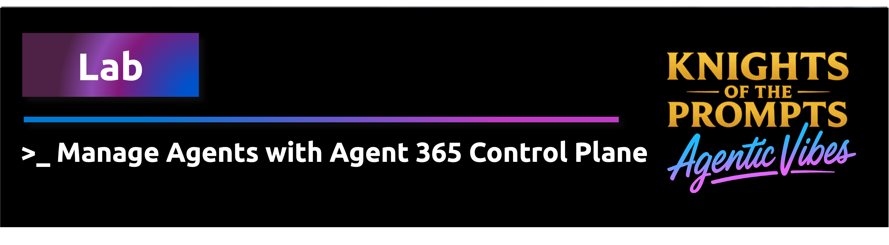

    

# Build a pro-code Microsoft Foundry agent that is registered and fully in sync with Agent 365

This lab walks you through building a small **pro-code** Microsoft Foundry agent
in Python, registering it as an **Entra Agent ID**, publishing it to **Agent 365**
via the **Microsoft 365 Agents Toolkit (`atk`)**, and then applying and testing
governance policies (DLP, Conditional Access, tool allow-list, audit, lifecycle)
from the Agent 365 admin center.

> The lab reuses the Foundry project, model deployment, and `.env` configured by
> the main workshop ([`src/workshop/README.md`](../../workshop/README.md)).
> Complete the main workshop first.

## Start the lab

👉 Open the notebook:
[`lab-create-agent365-managed-foundry-agent.ipynb`](lab-create-agent365-managed-foundry-agent.ipynb)

> [!IMPORTANT]
> Follow the instructions! :-)

## What you will learn

- How to create an **Entra Agent ID** workload identity for an AI agent
- How to build a pro-code Foundry agent with `azure-ai-projects` and bind it to
  the Entra Agent ID so runs execute under the agent's own identity
- How to author the Agent 365 manifest (`manifest.json` + declarative agent JSON)
  in code
- How to publish to Agent 365 with the Microsoft 365 Agents Toolkit CLI (`atk`)
- How to verify the agent is **fully in sync** across Entra, Foundry, and
  Agent 365 (single source-of-truth check)
- How to apply and **test** five categories of Agent 365 policies:
  DLP, Conditional Access, tool allow-list, audit, and lifecycle

## Files in this folder

| File | Purpose |
| --- | --- |
| `lab-create-agent365-managed-foundry-agent.ipynb` | The lab (run cell-by-cell) |
| `agent_app.py` | Pro-code agent module imported by the notebook |
| `requirements.txt` | Extra Python dependencies for this lab |
| `manifest/` | Agent 365 manifest files (generated by the notebook) |
