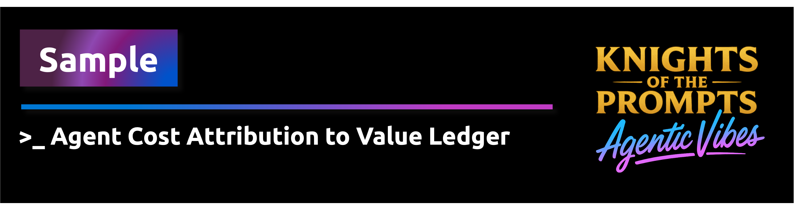
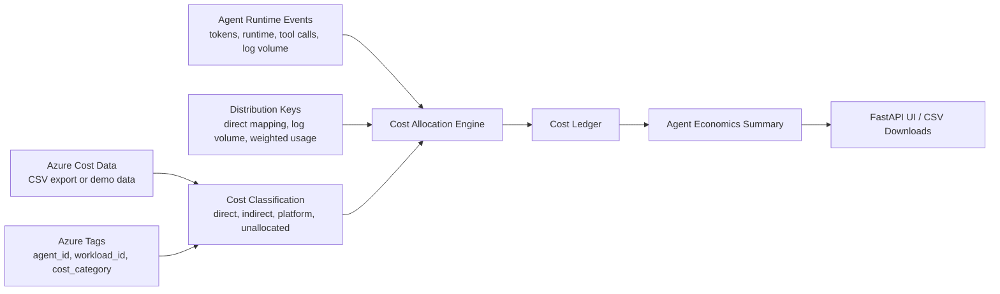
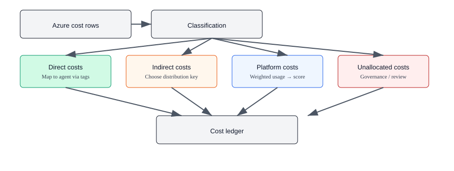
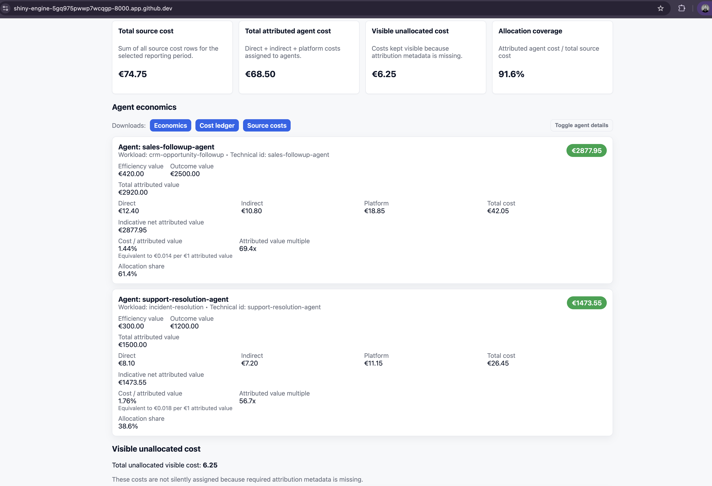

<div align="center">
    
</div>

# Accountable Agents — Part 2: Cost Attribution & Allocation

This sample shows how to attribute Azure costs back to individual AI agents, workloads and business outcomes.

It extends the first sample in this series, **Outcome-Aware Agents with a Value Ledger**, which focused on value attribution.

> **Value attribution tells us what the agent contributed.  
> Cost attribution tells us what it took to create that contribution.**

Together, both patterns help answer the enterprise question:

> **Is this agent worth it?**

---

## Why this matters

Most cloud cost data is reported at resource, meter, subscription, resource group or tag level.

But enterprise AI leaders increasingly need to understand cost at a more meaningful level:

- What did this agent cost?
- Which workload or business process consumed that cost?
- Which part was direct, shared, platform-level or still unallocated?
- How does that cost compare to the value the agent contributed to?

This sample treats an AI agent as a **logical cost object**.

Azure does not automatically bill an individual agent as a first-class cost object. Instead, this sample creates agent-level cost attribution by correlating:

```text
Azure Cost Data
+ Azure Resource Tags
+ Agent Runtime Events
+ Workload / Outcome Context
+ Distribution Keys
= Cost Attribution per Agent
```

The result is a deterministic **Cost Ledger** and an **Agent Economics Summary**.

---

## Relationship to Part 1

This sample is part of the **Accountable Agents** series.

| Part | Sample | Focus | Question |
|---|---|---|---|
| Part 1 | Outcome-Aware Agents with a Value Ledger | Value attribution | What value did the agent contribute to? |
| Part 2 | Cost Attribution for Accountable Agents | Cost attribution and allocation | What did it cost to create that contribution? |

This sample does not replace the Value Ledger pattern. It complements it.

The long-term direction is to combine both sides:

```text
Attributed Value
- Attributed Cost
= Indicative Net Attributed Value
```

This is not a certified ROI model. It is a practical architectural pattern for making agent economics more observable, explainable and governable.

---

## What this sample demonstrates

This sample demonstrates how to:

- classify Azure costs into direct, indirect, platform and unallocated categories;
- use Azure tags to identify agent, workload, business process and value stream context;
- allocate shared costs using deterministic distribution keys;
- keep unallocated costs visible as a governance signal;
- write cost attribution entries into a Cost Ledger;
- calculate an Agent Economics Summary per agent;
- replace deterministic mock data with Azure Cost Management export CSV data;
- optionally deploy low-cost Azure resources with the right tags to demonstrate the pattern in reality.

---

## Logical agents in this sample

The sample uses two logical agents:

| Agent | Workload | Business process | Value stream |
|---|---|---|---|
| `sales-followup-agent` | `crm-opportunity-followup` | Sales | Revenue growth |
| `support-resolution-agent` | `incident-resolution` | Support | Customer retention |

These are the cost objects that the sample attributes costs to.

---

## Architecture



A simplified functional version of the cost category diagram:



---

## Cost categories

| Category | Meaning | Detection | Handling |
|---|---|---|---|
| **Direct cost** | Cost that can be mapped directly to one agent or workload. | `agent_id`, `workload_id`, or `cost_category=direct`. | 100% mapped to the tagged agent/workload. |
| **Indirect cost** | Supporting operational cost shared across agents. | `cost_category=indirect` or `allocation_scope=indirect`. | Allocated using a usage-based distribution key, such as `log_volume_gb`. |
| **Platform cost** | Shared platform cost required to run the agent environment. | `cost_category=platform`, `allocation_scope=platform`, or `shared_service=true`. | Allocated using weighted usage across agents. |
| **Unallocated cost** | Cost that lacks sufficient metadata for reliable attribution. | Missing required tags or unsupported allocation metadata. | Kept visible and not silently assigned. |

Unallocated cost is not treated as a failure.

It is a governance signal: something needs to be tagged, mapped, reviewed or deliberately left unallocated.

---

## Distribution keys

Distribution keys define how shared costs are allocated to agents.

| Distribution key | Used for | Logic |
|---|---|---|
| `direct_tag_mapping` | Direct costs | Assign 100% to the agent/workload in the tags. |
| `log_volume_gb` | Indirect costs | Allocate proportionally by each agent’s log volume. |
| `request_count` | Fallback for indirect costs | Allocate proportionally by request count when log volume is unavailable. |
| `weighted_agent_usage` | Platform costs | Allocate by a weighted mix of token usage, runtime and tool calls. |
| `keep_visible` | Unallocated costs | Keep the cost visible without assigning it to an agent. |

Example weighted platform allocation:

```text
weighted_usage =
  0.5 * token_share
+ 0.3 * runtime_share
+ 0.2 * tool_call_share
```

The weights are configured in `allocation_rules.yaml`.

---

## Period, scope and cost basis

The sample is designed to make the reporting period explicit.

The UI should show:

- reporting period;
- cost source;
- currency;
- granularity;
- cost basis;
- generated timestamp.

Example:

```text
Reporting period: 2026-05
Source: demo CSV
Currency: EUR
Granularity: monthly
Cost basis: actual cost
```

When using Azure Cost Management export data, the selected period should match the billing/export period. Agent runtime metrics should be collected for the same time window.

Misaligned cost and runtime windows will create misleading allocations.

---

## Run locally

From the repository root:

```bash
cd src/samples/create-cost-attribution-for-agents

python -m venv .venv
source .venv/bin/activate

pip install -r requirements.txt

python cost-attribution-example.py
```

Run the UI:

```bash
uvicorn app:app --reload
```

Open:

```text
http://127.0.0.1:8000
```

Screenshot of a very very simple UI:



In production scenario's PowerBI (or alike) will probably do a much better job ;-)

The UI shows:

- cost category totals;
- source cost vs attributed cost;
- visible unallocated cost;
- per-agent economics;
- cost ledger entries;
- CSV download links for economics, cost ledger and source costs.

---

## API endpoints

The FastAPI app exposes:

| Endpoint | Description |
|---|---|
| `/` | Main UI |
| `/api/economics` | Agent economics summary |
| `/api/cost-ledger` | Cost ledger entries |
| `/api/source-costs` | Source cost rows |

---

## Data files

The deterministic demo uses these files:

| File | Purpose |
|---|---|
| `data/azure-cost-export-sample.csv` | Sample Azure Cost Management-style cost rows. |
| `data/agent-runtime-events.json` | Per-agent runtime metrics used for allocation. |
| `data/value-ledger-sample.json` | Value attribution entries used for economics calculations. |
| `data/expected-agent-economics.json` | Expected deterministic results for tests. |
| `allocation_rules.yaml` | Distribution keys, weights and allocation settings. |

The demo data is synthetic and deterministic so the workshop can be reproduced without waiting for Azure billing data.

---

## Replacing mock data with Azure Cost Management export CSV

The sample can load Azure Cost Management-style CSV data.

The mock CSV can be replaced with real export data as long as the expected fields or mappings are available.

The sample expects cost rows with fields similar to:

```text
date
resourceId
resourceGroupName
serviceName
meterCategory
meterSubCategory
costInBillingCurrency
billingCurrency
tags
```

The `tags` column may contain a JSON object with keys such as:

```json
{
  "agent_id": "sales-followup-agent",
  "workload_id": "crm-opportunity-followup",
  "cost_category": "direct",
  "allocation_scope": "direct",
  "business_process": "sales",
  "value_stream": "revenue-growth",
  "owner": "ai-platform-team",
  "environment": "demo"
}
```

Real Azure Cost Management export data is not real-time. Expect delays before newly created resources and usage appear in cost exports.

---

## Azure tagging strategy

Recommended tags:

| Tag | Purpose |
|---|---|
| `accountable_agents_demo` | Marker for demo resources. |
| `cost_category` | One of `direct`, `indirect`, `platform`. Used for classification. |
| `allocation_scope` | Alternate marker for classification. |
| `agent_id` | Stable identifier for the logical agent. |
| `workload_id` | Identifier for the workload or routine the agent supports. |
| `business_process` | Business process used for reporting and grouping. |
| `value_stream` | Business value stream the agent contributes to. |
| `distribution_key` | Allocation rule for shared costs. |
| `shared_service` | Indicates shared infrastructure or platform services. |
| `owner` | Team or person accountable for the resource. |
| `environment` | Environment such as `demo`, `dev`, `test`, `prod`. |

Tagging guidance:

- Prefer tagging the Azure resource that incurs the charge.
- Use stable technical identifiers for `agent_id`.
- Do not store sensitive data in tags.
- Use Infrastructure as Code to apply tags consistently.
- Enforce required tags with Azure Policy where appropriate.
- Treat changes to `allocation_rules.yaml` as governance events.

---

## Example: applying tags

Azure CLI:

```bash
az resource tag \
  --ids <resource-id> \
  --tags \
    accountable_agents_demo=true \
    agent_id=sales-followup-agent \
    workload_id=crm-opportunity-followup \
    cost_category=direct \
    allocation_scope=direct \
    owner=ai-platform-team \
    environment=demo
```

Bicep:

```bicep
resource storage 'Microsoft.Storage/storageAccounts@2023-01-01' = {
  name: storageAccountName
  location: resourceGroup().location
  sku: {
    name: 'Standard_LRS'
  }
  kind: 'StorageV2'
  tags: {
    accountable_agents_demo: 'true'
    agent_id: 'sales-followup-agent'
    workload_id: 'crm-opportunity-followup'
    cost_category: 'direct'
    allocation_scope: 'direct'
    owner: 'ai-platform-team'
    environment: 'demo'
  }
}
```

---

## Optional Azure demo resources

The sample includes optional Bicep templates that create low-cost Azure resources with the correct tags.

These resources are not meant to represent a production-grade agent platform.

They exist to demonstrate how real Azure resource costs can be tagged and attributed to logical agent cost objects.

Deploy:

```bash
cd src/samples/create-cost-attribution-for-agents/infra
chmod +x deploy.sh
./deploy.sh
```

Optionally deploy export storage:

```bash
./deploy.sh --with-export-storage
```

The demo resources represent:

| Resource purpose | Cost category | Attribution logic |
|---|---|---|
| Sales agent runtime/supporting resource | Direct | Mapped to `sales-followup-agent`. |
| Support agent runtime/supporting resource | Direct | Mapped to `support-resolution-agent`. |
| Shared observability resource | Indirect | Allocated by `log_volume_gb`. |
| Shared platform state/configuration | Platform | Allocated by `weighted_agent_usage`. |
| Intentionally incomplete resource | Unallocated | Kept visible for governance review. |

See:

```text
infra/README.md
```

for detailed deployment and cleanup instructions.

---

## Cleanup

Do not delete the demo resource group if it also contains the main Microsoft Foundry workshop resources.

Only run this command if the resource group contains only the cost attribution demo resources:

```bash
az group delete --name "$AZURE_RESOURCE_GROUP_NAME" --yes --no-wait
```

---

## Using Azure Blob exports

The sample supports loading Azure Cost export CSVs from Azure Blob Storage.

Two authentication modes are supported:

| Mode | Usage |
|---|---|
| Connection string | Useful for local testing. |
| Managed Identity | Recommended for production. |

Local example:

```bash
export AZ_BLOB_CONNECTION_STRING="<your-connection-string>"
export AZ_BLOB_CONTAINER="cost-exports"
export AZ_BLOB_BLOBNAME="daily/2026-05-01.csv"

export COST_SOURCE=blob

python cost-attribution-example.py
```

Python example:

```python
from loaders import load_cost_rows_from_blob

rows = load_cost_rows_from_blob(
    connection_string="<your-connection-string>",
    container_name="cost-exports",
    blob_name="daily/2026-05-01.csv",
    registry_path="processed_blobs.json"
)
```

For production, prefer Managed Identity with the `Storage Blob Data Reader` role.

## How to create an Azure Cost Management export (step-by-step)

Short overview  
Recommended workshop pattern: schedule a CSV export to a Storage Account container and load that CSV with the sample (repeatable and reproducible).

1) Create a Storage Account + container (CLI)
```bash
az group create -n <rg> -l <location>
az storage account create -n <storageName> -g <rg> -l <location> --sku Standard_LRS --kind StorageV2
az storage container create -n cost-exports --account-name <storageName>
```

2) Configure the export (Portal - easiest)
- Open "Cost Management + Billing" → choose scope (Subscription or Management Group) → `Exports` → `Add`.
- Give it a name (e.g. `daily-agent-costs`).
- Select format: **CSV**.
- Destination: pick the Storage Account, container and optional folder (e.g. `daily/`).
- Recurrence: `Daily` or `Monthly` depending on your reporting period.
- Ensure columns like `costInBillingCurrency`, `billingCurrency`, `resourceId` and `tags` (or flattened tag fields) are included.
- Save and wait for the first export.

3) Validate the export
- Download the CSV from the container and verify the header and the `tags` column (JSON or flattened tags).
- Ensure the export period matches the period of your runtime telemetry.

4) Start the sample locally with the export
```bash
export AZ_BLOB_CONNECTION_STRING="<connection-string>"   # local testing
export AZ_BLOB_CONTAINER="cost-exports"
export AZ_BLOB_BLOBNAME="daily/2026-05-01.csv"
export COST_SOURCE=blob
python cost-attribution-example.py
```

Permissions and roles
- Creating/configuring an export typically requires `Cost Management Contributor` or Owner on the scope.
- The export writes to the Storage Account; ensure the exporter (or the user configuring it) has rights on the container.
- For production ingestion: give the ingesting service (Managed Identity) at least `Storage Blob Data Reader`.

Automation / infra
- Use the included template as a starting point: [src/samples/create-cost-attribution-for-agents/infra/cost-export-storage.bicep](src/samples/create-cost-attribution-for-agents/infra/cost-export-storage.bicep#L1-L200) or the deploy script [src/samples/create-cost-attribution-for-agents/infra/deploy.sh](src/samples/create-cost-attribution-for-agents/infra/deploy.sh#L1).
- Production pattern: Cost Export → Storage → Event Grid → Azure Function → check idempotency → stream CSV → process.

Realtime Cost Management API (possible, but out of scope for the workshop)
- It's technically possible to query Cost Management / Consumption APIs directly, but this requires:
  - a backend service with Managed Identity or service principal and correct RBAC;
  - token handling, paging, throttling and retries;
  - safe credential storage or use of Managed Identity;
  - mapping query results to this sample's `AzureCostRow` schema;
  - additional caching, reconciliation and governance.
- For the workshop and reproducible tests we therefore use scheduled CSV exports; realtime queries are a follow-up option for production integration.
---

## Streaming and idempotency

The sample exposes a streaming blob loader with an optional file-based registry for idempotency.

For production, replace the local registry file with a durable store such as:

- Azure Table Storage;
- Cosmos DB;
- Azure SQL;
- another operational metadata store.

High-level automation pattern:

```text
Azure Cost Export
→ Storage Account
→ Event Grid
→ Azure Function
→ Check processed blob registry
→ Stream CSV
→ Classify costs
→ Allocate costs
→ Write Cost Ledger
→ Mark blob as processed
```

Minimal pseudocode:

```python
def handler(event):
    blob_url = event["data"]["url"]
    etag = get_blob_etag(blob_url)

    if processed_registry.exists(etag):
        return

    for row in stream_csv(blob_url):
        process_row(row)

    run_allocation_and_commit()
    processed_registry.save(etag, processed_at=now())
```

See `WORKSHOP-CHECKLIST.md` for a short checklist to wire the full export-to-allocation pipeline.

---

## Testing

Run:

```bash
pytest
```

The tests verify:

- cost classification;
- direct attribution;
- indirect allocation;
- platform allocation;
- visible unallocated costs;
- cost conservation;
- deterministic agent economics.

---

## Limitations and governance notes

This sample is intentionally small and deterministic.

Important limitations:

- Demo data is synthetic and deterministic.
- Real Azure Cost Management exports are delayed and not real-time.
- Tags are useful attribution signals, but they are not a perfect causal model.
- Allocation rules and distribution keys require governance.
- Unallocated costs are intentionally visible and should be reviewed.
- Outcome value represents contribution or association, not strict causal proof.
- The sample demonstrates an architectural pattern, not a certified ROI calculation.

---

## Production considerations

For production scenarios:

- enforce required tags through Azure Policy;
- automate tagging through Bicep, Terraform or deployment pipelines;
- version-control allocation rules;
- align cost export periods with runtime telemetry windows;
- store processed blob state durably;
- reconcile allocations periodically with FinOps and engineering teams;
- integrate with formal FinOps tooling where appropriate;
- consider persisting Cost Ledger entries in a tamper-evident ledger if auditability is required.

---

## Next steps

Use the FastAPI UI to explore the sample locally.

Then replace the deterministic CSV with your own Azure Cost Management export and adjust:

- tag mappings;
- distribution keys;
- allocation weights;
- runtime telemetry sources;
- reporting period selection.

The core pattern remains the same:

```text
Cost attribution for agents is not just tagging Azure resources.
It is the correlation of Azure cost data, agent identity, runtime telemetry,
workload context and allocation rules into a defensible cost view per agent.
```