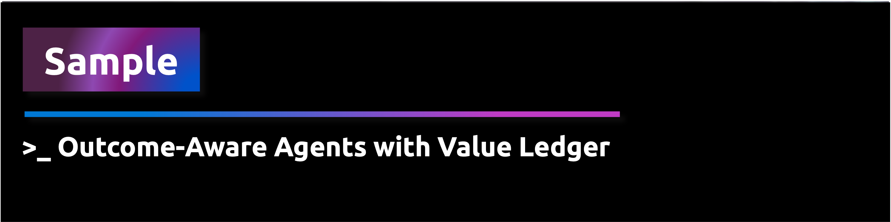
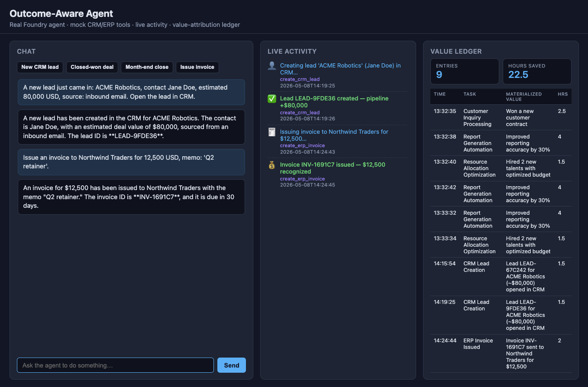
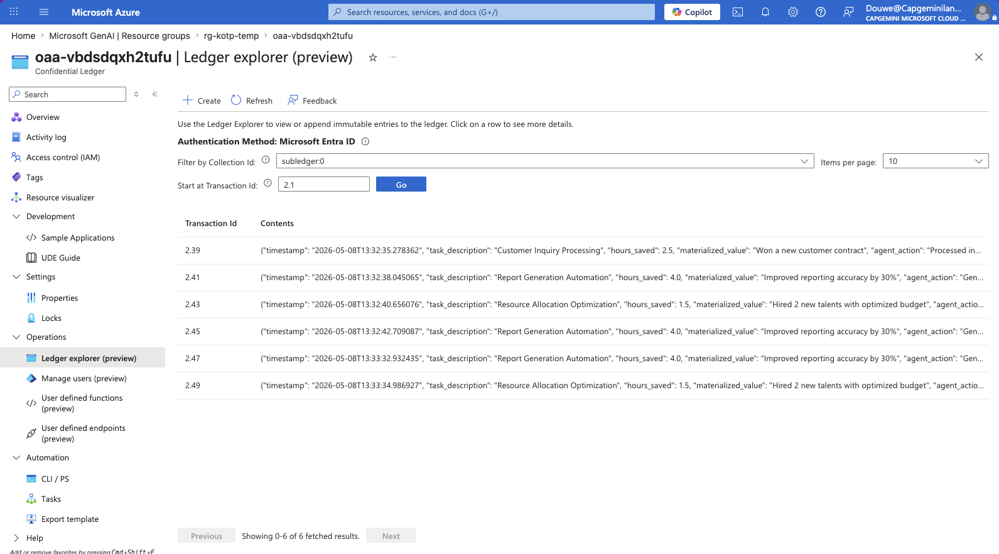
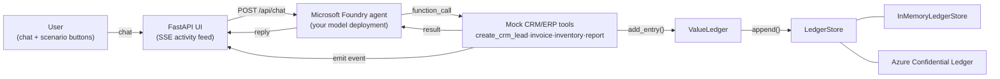

<div align="center">
    
</div>


Build a small **outcome-aware agent** that records every action it takes, the
hours it saved, and the materialized business value — then visualize the ledger
in a lightweight web UI and (optionally) persist it to **Azure Confidential
Ledger** for tamper-evident, append-only storage with cryptographic receipts.

> Why this matters: leaders want to attribute *outcomes*, not just activity, to
> AI agents. A signed value ledger turns "the agent did stuff" into auditable
> evidence the business can report on.

> [!IMPORTANT]
> **The CRM/ERP systems are simulated, but the agent is real.** When you chat
> with the UI, your message goes to a Microsoft Foundry agent (your
> `PROJECT_ENDPOINT`, your model deployment) which decides which tools to
> call. The four tools — `create_crm_lead`, `create_erp_invoice`,
> `update_inventory_level`, `generate_finance_report` — don't actually talk
> to Salesforce, SAP, or Dynamics; they return plausible mock data and emit
> a live activity event so the UI can show the moment value is materialized.
>
> The point of the lab is the **value-attribution mechanic**: every tool call
> writes a `ValueEntry` (timestamp, hours saved, materialized value) into the
> ledger, which can be persisted to **Azure Confidential Ledger** for
> tamper-evident proof. In a real system you would swap the mock tool bodies
> for real CRM/ERP API calls and keep the same ledger shape.

---

## What you will build

| Component | Description |
| --- | --- |
| `FoundryOutcomeAgent` | Real Microsoft Foundry agent (`AIProjectClient` + Responses API) with four registered function tools. |
| `tools.py` | Mock `create_crm_lead`, `create_erp_invoice`, `update_inventory_level`, `generate_finance_report` — emit live activity events and write to the ledger. |
| `ValueLedger` | Records each tool call as a `ValueEntry` (timestamp, hours saved, materialized value). |
| `LedgerStore` | Pluggable storage: `InMemoryLedgerStore` (local) or `ConfidentialLedgerStore` (Azure). |
| FastAPI UI | Chat box, scenario presets, live SSE activity feed, ledger table. |
| `outcome-aware-agent-example.py` | Offline pure-Python demo (no Azure / no LLM) for the smoke-test. |
| Bicep (`infra/`) | Deploys an Azure Confidential Ledger and assigns you the `Administrator` role. |

---

## Prerequisites

> [!IMPORTANT]
> **Run the main Microsoft Foundry workshop first.** This lab builds on top of
> it and assumes everything that workshop sets up is already in place — the
> Azure subscription, resource group, Foundry project, GitHub Codespace (or
> local devcontainer), Python venv, model deployment, and the populated
> [`src/workshop/.env`](../../workshop/.env) file.
>
> Start here: [`src/workshop/README.md`](../../workshop/README.md). Come back
> to this lab once you can run the Contoso Sales agent end-to-end.

After completing the main workshop you should already have:

- A working Codespace / devcontainer with Python **3.10+** and the workspace-wide
  `.venv` at the repo root.
- `az login` completed in that environment.
- `src/workshop/.env` populated by `setup_env.py` with at minimum:
  `AZURE_SUBSCRIPTION_ID`, `AZURE_RESOURCE_GROUP_NAME`, `PROJECT_ENDPOINT`,
  `AGENT_MODEL_DEPLOYMENT_NAME`.

This lab adds **one extra prerequisite** — the Confidential Ledger resource
provider must be registered on your subscription (one-time, ~2 min):

```bash
az provider register --namespace Microsoft.ConfidentialLedger
```

---

## 1. Run the agent UI

This lab reuses the workshop-wide virtual environment at the repository root
(the same `.venv` used by every other Microsoft Foundry lab) so dependencies
stay in one place.

```bash
cd src/samples/create-outcome-aware-agents

# Activate the workshop venv
source ../../../.venv/bin/activate

# Install the lab-specific extras (FastAPI, SSE, azure-ai-projects, …)
pip install -r requirements.txt

# Optional: pure-Python offline demo — no Azure, no LLM, just the ledger.
python outcome-aware-agent-example.py

# Real agent + chat UI. Reads PROJECT_ENDPOINT and AGENT_MODEL_DEPLOYMENT_NAME
# from src/workshop/.env. Uses your `az login` session for auth.
uvicorn app:app --reload
```

Open <http://127.0.0.1:8000>. The page has three panels:

1. **Chat** — free-form input plus four scenario presets (new lead,
   closed-won deal, month-end close, issue invoice). Hitting *Send* invokes
   the Foundry agent, which decides which mock CRM/ERP tools to call.
2. **Live activity** — server-sent events show every tool call as it happens
   (`Creating lead 'ACME Robotics'…` → `Lead LEAD-A1B2C3 created — pipeline +$80,000`).
3. **Value ledger** — each tool call writes a `ValueEntry`. Total entries and
   total hours saved update in real time.




---

## 2. Deploy Azure Confidential Ledger (optional, recommended)

Confidential Ledger is Azure's purpose-built service for **append-only,
tamper-evident** records. It's ideal for a value ledger: every entry gets a
cryptographic receipt the business can verify later. We use `ledgerType: 'Public'`
to keep the workshop digestible — no consortium certificate management is
required, and access is governed by AAD role assignments only.

### 2.1 Configure your `.env`

The Outcome-Aware Agent reuses the workshop-wide env file at
**`src/workshop/.env`** — the same one used by the other Microsoft Foundry
labs. The deployment commands below reuse the workshop's existing
**`AZURE_RESOURCE_GROUP_NAME`** so everything lands in one resource group.

Make sure the following keys are set in `src/workshop/.env`:

```bash
LEDGER_BACKEND=memory
ACL_ENDPOINT=
LOCATION=swedencentral                   # ACL-supported: swedencentral | eastus | westeurope | australiaeast | southeastasia
```

Load the values into the current shell (every subsequent step assumes this):

```bash
set -a && source ../../workshop/.env && set +a
```

### 2.2 Create the resource group

If the workshop resource group already exists you can skip this step.

```bash
az group create -n "$AZURE_RESOURCE_GROUP_NAME" -l "$LOCATION"
```

### 2.3 Deploy the Bicep template

```bash
PRINCIPAL_ID=$(az ad signed-in-user show --query id -o tsv)

az deployment group create \
  -g "$AZURE_RESOURCE_GROUP_NAME" \
  -n outcome-aware-ledger \
  -f infra/outcome-aware-ledger.bicep \
  -p principalId="$PRINCIPAL_ID" location="$LOCATION"
```

Capture the `ledgerUri` output and write it back into the workshop `.env`:

```bash
LEDGER_URI=$(az deployment group show \
  -g "$AZURE_RESOURCE_GROUP_NAME" -n outcome-aware-ledger \
  --query properties.outputs.ledgerUri.value -o tsv)

WORKSHOP_ENV=../../workshop/.env
sed -i.bak "s|^ACL_ENDPOINT=.*|ACL_ENDPOINT=$LEDGER_URI|" "$WORKSHOP_ENV"
sed -i.bak "s|^LEDGER_BACKEND=.*|LEDGER_BACKEND=acl|" "$WORKSHOP_ENV" && rm -f "$WORKSHOP_ENV.bak"
echo "$LEDGER_URI"
```

### 2.4 Run the UI against Confidential Ledger

```bash
uvicorn app:app --reload
```

Chat with the agent. Every tool call now writes its `ValueEntry` to Azure
Confidential Ledger via `DefaultAzureCredential` (your `az login` session).
Reload the page — entries are loaded back from the ledger across restarts.

You can browse the value attribution entries in the Azure portal under your
Confidential Ledger → **Operations** → **Ledger explorer (preview)**:



### 2.5 (Optional) Inspect the ledger from the CLI

```bash
LEDGER_NAME=$(az deployment group show -g "$AZURE_RESOURCE_GROUP_NAME" -n outcome-aware-ledger \
  --query properties.outputs.ledgerName.value -o tsv)

az confidentialledger ledger-entry list \
  --ledger-name "$LEDGER_NAME" \
  --collection-id subledger:0
```

Each entry has a `transactionId` you can use to fetch a cryptographic receipt
— that receipt is what makes the ledger *evidentially* valuable.


---

## 3. Clean up

The ledger shares the workshop resource group with the rest of the Foundry
labs, so **do not delete the resource group** here — you'd take down the
Microsoft Foundry project, hub, and AI services with it. Delete just the
ledger resource instead:

```bash
LEDGER_NAME=$(az deployment group show -g "$AZURE_RESOURCE_GROUP_NAME" -n outcome-aware-ledger \
  --query properties.outputs.ledgerName.value -o tsv)

az confidentialledger delete \
  --name "$LEDGER_NAME" \
  --resource-group "$AZURE_RESOURCE_GROUP_NAME" \
  --yes
```

Confidential Ledger has a small per-hour cost while running, so remove it when
you're done with the lab. If you want to tear down the *entire* workshop
environment (everything in the resource group), follow the cleanup step in
[`src/workshop/README.md`](../../workshop/README.md) instead.

---

## Project layout

```
create-outcome-aware-agents/
├── outcome-aware-agent-example.py   # Offline pure-Python demo (no Azure / no LLM)
├── agent.py                         # FoundryOutcomeAgent + ValueLedger + offline OutcomeAwareAgent
├── tools.py                         # Mock CRM/ERP function tools + agent system prompt
├── event_bus.py                     # In-process pub/sub for SSE
├── ledger_store.py                  # LedgerStore protocol + In-memory + ACL
├── app.py                           # FastAPI UI (reads src/workshop/.env)
├── templates/index.html             # Chat / activity / ledger page
├── requirements.txt
└── infra/
    └── outcome-aware-ledger.bicep   # ACL deployment (single self-contained template)
```

---

## Architecture



Switch backends with one environment variable — no code change.

---

## Troubleshooting

| Symptom | Fix |
| --- | --- |
| Yellow banner: "Foundry agent is not configured" | Make sure `PROJECT_ENDPOINT` and `AGENT_MODEL_DEPLOYMENT_NAME` are set in `src/workshop/.env`, then restart `uvicorn`. |
| `POST /api/chat` returns 503 | Same as above — the agent failed to start; check the `uvicorn` logs for the original Azure error. |
| `LEDGER_BACKEND=acl requires ACL_ENDPOINT` | Set `ACL_ENDPOINT` in `src/workshop/.env` to the `ledgerUri` from the deployment outputs. |
| `DefaultAzureCredential failed to retrieve a token` | Run `az login` in the same shell that launches `uvicorn`. |
| `403 Forbidden` from the ledger | The signed-in user doesn't have a role on the ledger. Re-deploy with the correct `principalId`. |
| Activity feed never updates | The browser couldn't open the SSE stream — check the browser dev-tools network tab for `/events`, and confirm no proxy is buffering responses. |
| ACL not available in your region | Use one of: `swedencentral`, `eastus`, `westeurope`, `australiaeast`, `southeastasia`. |
| Provider not registered | `az provider register --namespace Microsoft.ConfidentialLedger` (takes a few minutes). |
