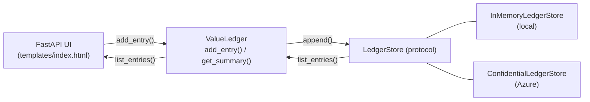

<div align="center">
    
</div>


Build a small **outcome-aware agent** that records every action it takes, the
hours it saved, and the materialized business value — then visualize the ledger
in a lightweight web UI and (optionally) persist it to **Azure Confidential
Ledger** for tamper-evident, append-only storage with cryptographic receipts.

> Why this matters: leaders want to attribute *outcomes*, not just activity, to
> AI agents. A signed value ledger turns "the agent did stuff" into auditable
> evidence the business can report on.

> [!IMPORTANT]
> **The agent in this lab is fictional.** It does *not* call an LLM, talk to a
> CRM, or actually process a customer inquiry. The three buttons trigger plain
> Python methods on `OutcomeAwareAgent` that immediately write a hard-coded
> "this is what the agent would have done" entry — `Customer Inquiry`,
> `Report Generation`, `Resource Allocation` — straight into the value ledger.
> The point of the lab is **the value-attribution mechanic itself**: how each
> action is captured (timestamp, hours saved, materialized value) and how those
> entries are stored, surfaced in a UI, and (optionally) anchored in Azure
> Confidential Ledger for tamper-evident proof. In a real system you would
> swap the simulated method bodies for actual agent calls (Microsoft Foundry
> Agents, Semantic Kernel, etc.) and keep the same ledger shape.

---

## What you will build

| Component | Description |
| --- | --- |
| `OutcomeAwareAgent` | Performs simulated tasks (customer inquiries, reports, allocation). |
| `ValueLedger` | Records each action as a `ValueEntry` (timestamp, hours saved, materialized value). |
| `LedgerStore` | Pluggable storage: `InMemoryLedgerStore` for the local demo, `ConfidentialLedgerStore` for Azure. |
| FastAPI UI | Minimal web page with metrics, action buttons, and an entries table. |
| Bicep (`infra/`) | Deploys an Azure Confidential Ledger and assigns you the `Administrator` role. |

---

## Prerequisites

- Python **3.10+**
- An Azure subscription (only required for the Azure step)
- **Azure CLI** logged in: `az login`
- The Confidential Ledger resource provider registered:
  ```bash
  az provider register --namespace Microsoft.ConfidentialLedger
  ```

---

## 1. Run locally (in-memory ledger)

This lab reuses the workshop-wide virtual environment at the repository root
(the same `.venv` used by every other Microsoft Foundry lab) so dependencies
stay in one place.

```bash
cd src/samples/create-outcome-aware-agents

# Activate the workshop venv (create it once if it doesn't exist yet:
#   python -m venv ../../../.venv  &&  source ../../../.venv/bin/activate
#   pip install -r ../../workshop/requirements.txt)
source ../../../.venv/bin/activate

# Install the lab-specific extras (FastAPI, jinja2, azure-confidentialledger, …)
pip install -r requirements.txt

# Pure-Python terminal demo
python outcome-aware-agent-example.py

# Web UI (in-memory by default)
uvicorn app:app --reload
```

Open <http://127.0.0.1:8000>. Click each action button and watch entries and
total hours saved update.


---

## 2. Deploy Azure Confidential Ledger (optional, recommended)

Confidential Ledger is Azure's purpose-built service for **append-only,
tamper-evident** records. It's ideal for a value ledger: every entry gets a
cryptographic receipt the business can verify later. We use `ledgerType: 'Public'`
to keep the workshop digestible — no consortium certificate management is
required, and access is governed by AAD role assignments only.

### 2.1 Configure your `.env`

The Outcome-Aware Agent reuses the workshop-wide env file at
**`src/workshop/.env`** — the same one used by the other Microsoft Foundry
labs. The deployment commands below reuse the workshop's existing
**`AZURE_RESOURCE_GROUP_NAME`** so everything lands in one resource group.

Make sure the following keys are set in `src/workshop/.env`:

```bash
LEDGER_BACKEND=memory
ACL_ENDPOINT=
LOCATION=swedencentral                   # ACL-supported: swedencentral | eastus | westeurope | australiaeast | southeastasia
```

Load the values into the current shell (every subsequent step assumes this):

```bash
set -a && source ../../workshop/.env && set +a
```

### 2.2 Create the resource group

If the workshop resource group already exists you can skip this step.

```bash
az group create -n "$AZURE_RESOURCE_GROUP_NAME" -l "$LOCATION"
```

### 2.3 Deploy the Bicep template

```bash
PRINCIPAL_ID=$(az ad signed-in-user show --query id -o tsv)

az deployment group create \
  -g "$AZURE_RESOURCE_GROUP_NAME" \
  -n outcome-aware-ledger \
  -f infra/outcome-aware-ledger.bicep \
  -p principalId="$PRINCIPAL_ID" location="$LOCATION"
```

Capture the `ledgerUri` output and write it back into the workshop `.env`:

```bash
LEDGER_URI=$(az deployment group show \
  -g "$AZURE_RESOURCE_GROUP_NAME" -n outcome-aware-ledger \
  --query properties.outputs.ledgerUri.value -o tsv)

WORKSHOP_ENV=../../workshop/.env
sed -i.bak "s|^ACL_ENDPOINT=.*|ACL_ENDPOINT=$LEDGER_URI|" "$WORKSHOP_ENV"
sed -i.bak "s|^LEDGER_BACKEND=.*|LEDGER_BACKEND=acl|" "$WORKSHOP_ENV" && rm -f "$WORKSHOP_ENV.bak"
echo "$LEDGER_URI"
```

### 2.4 Run the UI against Confidential Ledger

```bash
uvicorn app:app --reload
```

Click an action button. The agent now writes each entry to Azure Confidential
Ledger via `DefaultAzureCredential` (your `az login` session). Reload the page
— entries are loaded back from the ledger.

You can also browse the same entries in the Azure portal under your
Confidential Ledger → **Operations** → **Ledger explorer (preview)**:


### 2.5 (Optional) Inspect the ledger from the CLI

```bash
LEDGER_NAME=$(az deployment group show -g "$AZURE_RESOURCE_GROUP_NAME" -n outcome-aware-ledger \
  --query properties.outputs.ledgerName.value -o tsv)

az confidentialledger ledger-entry list \
  --ledger-name "$LEDGER_NAME" \
  --collection-id subledger:0
```

Each entry has a `transactionId` you can use to fetch a cryptographic receipt
— that receipt is what makes the ledger *evidentially* valuable.


---

## 3. Clean up

The ledger shares the workshop resource group with the rest of the Foundry
labs, so **do not delete the resource group** here — you'd take down the
Microsoft Foundry project, hub, and AI services with it. Delete just the
ledger resource instead:

```bash
LEDGER_NAME=$(az deployment group show -g "$AZURE_RESOURCE_GROUP_NAME" -n outcome-aware-ledger \
  --query properties.outputs.ledgerName.value -o tsv)

az confidentialledger delete \
  --name "$LEDGER_NAME" \
  --resource-group "$AZURE_RESOURCE_GROUP_NAME" \
  --yes
```

Confidential Ledger has a small per-hour cost while running, so remove it when
you're done with the lab. If you want to tear down the *entire* workshop
environment (everything in the resource group), follow the cleanup step in
[`src/workshop/README.md`](../../workshop/README.md) instead.

---

## Project layout

```
create-outcome-aware-agents/
├── outcome-aware-agent-example.py   # Pure-Python terminal demo
├── agent.py                         # OutcomeAwareAgent + ValueLedger
├── ledger_store.py                  # LedgerStore protocol + In-memory + ACL
├── app.py                           # FastAPI UI (reads src/workshop/.env)
├── templates/index.html             # Minimal Jinja2 page
├── requirements.txt
└── infra/
    └── outcome-aware-ledger.bicep   # ACL deployment (single self-contained template)
```

---

## Architecture



Switch backends with one environment variable — no code change.

---

## Troubleshooting

| Symptom | Fix |
| --- | --- |
| `LEDGER_BACKEND=acl requires ACL_ENDPOINT` | Set `ACL_ENDPOINT` in `src/workshop/.env` to the `ledgerUri` from the deployment outputs. |
| `DefaultAzureCredential failed to retrieve a token` | Run `az login` in the same shell that launches `uvicorn`. |
| `403 Forbidden` from the ledger | The signed-in user doesn't have a role on the ledger. Re-deploy with the correct `principalId`. |
| ACL not available in your region | Use one of: `swedencentral`, `eastus`, `westeurope`, `australiaeast`, `southeastasia`. |
| Provider not registered | `az provider register --namespace Microsoft.ConfidentialLedger` (takes a few minutes). |
