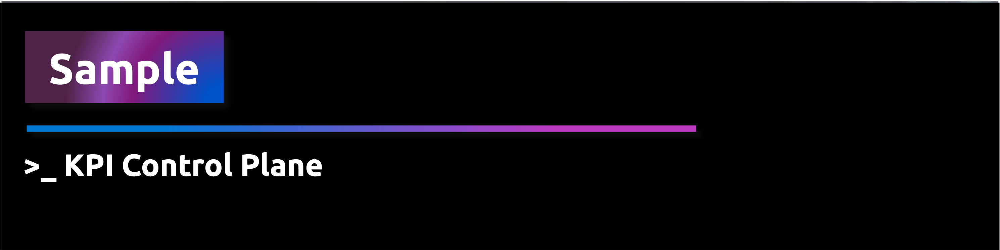
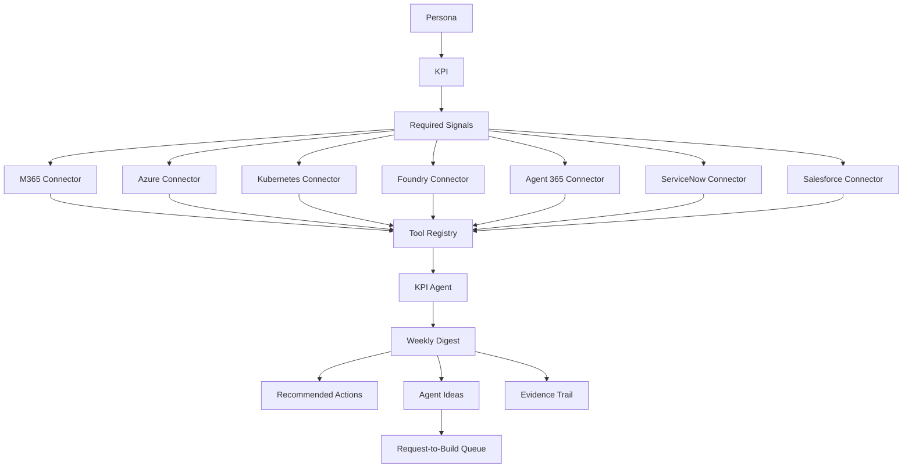
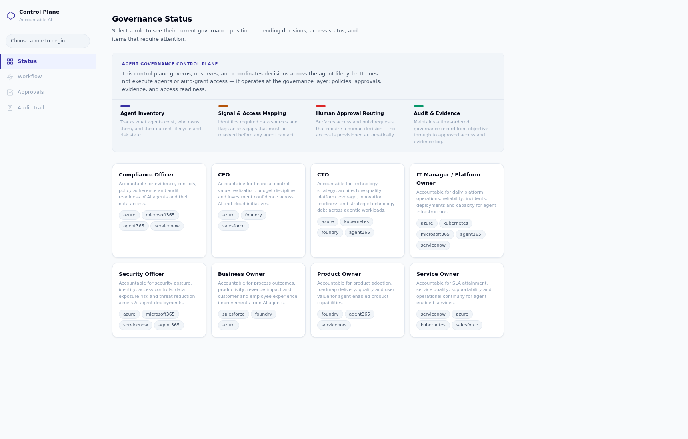
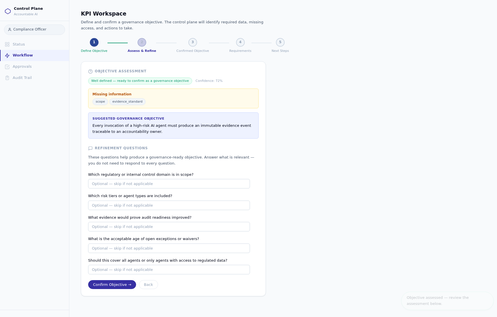
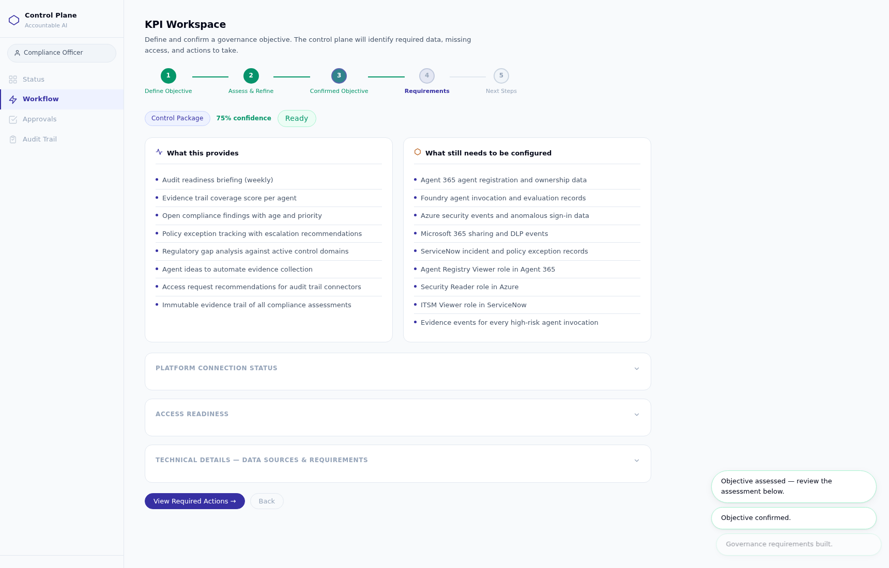
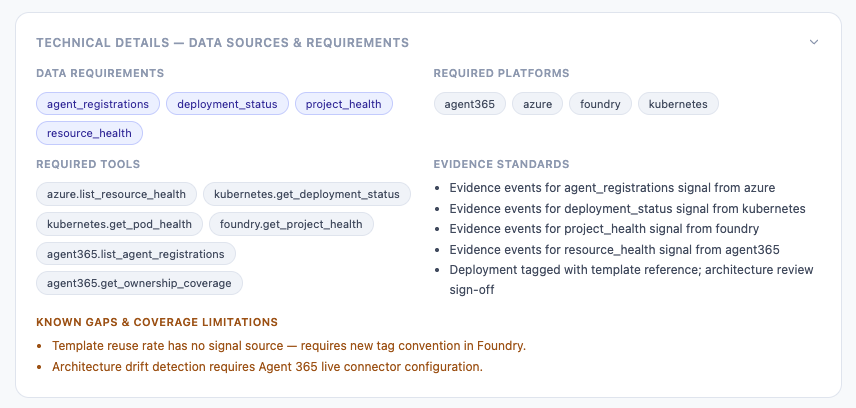
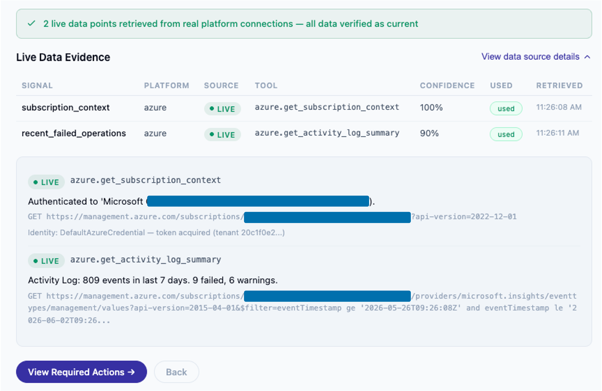

<div align="center">
    
</div>

> **Accountable Agents series — Part 4 of 4**
>
> | Part | Sample | Core question |
> |------|--------|---------------|
> | 1 | [Value Attribution](../create-rag-agent-using-notebook/) | What value did the agent contribute? |
> | 2 | [Cost Attribution](../create-cost-attribution-for-agents/) | What did it cost to create that value? |
> | 3 | [Agent Reporting](../create-agent-reporting/) | Which signals should be reported to which persona? |
> | 4 | **Control Plane** *(this sample)* | How do those signals become decisions, actions, agent ideas and evidence? |

**"Reporting makes agent behavior visible. A control plane makes agent behavior governable."**

---

## What is this?

This sample demonstrates a **Persona-Aware Universal Control Plane** — a governance and decision layer
that sits above your AI agents and translates persona-specific KPIs into required signals, platform
connector calls, recommended actions, agent ideas, and an evidence trail.

This is **not** a replacement for:

- Microsoft Agent 365
- Microsoft Foundry Control Plane
- ServiceNow AI Control Tower
- Azure Monitor / Kubernetes or any hyperscale native control plane

This is an **accountability overlay** — a pattern that shows how signals from those platforms can be
aggregated, interpreted through a KPI lens, and surfaced as governance evidence for specific human
personas.

---

## The accountability progression

```
Value Attribution  →  Cost Attribution  →  Agent Reporting  →  Control Plane
       │                    │                    │                    │
 "What value did       "What did it          "Which signals      "How do those
  the agent             cost to create         to which            signals become
  contribute?"          that value?"           persona?"           decisions?"
```

Each part builds on the previous. The control plane is the capstone: it closes the loop from signal
to governance action.

---

## Core architecture

The control plane implements this signal-to-governance flow, **per persona**:



---

## Why connector-first?

Each external platform is wrapped in a **connector** that implements a shared `PlatformConnector`
interface. This means:

1. **Mock adapters** ship by default — deterministic local demo data, no credentials required.
2. **Live adapters** implement the same interface — swap in a real API-backed connector by changing
   `mode: live` in the config.
3. **Hybrid mode** — live APIs where configured, mock data everywhere else.

Once a connector is live, its capabilities are registered in the **Tool Registry**. The KPI Agent
discovers available tools from the registry and uses them to gather signals.

### Platform connectors and readiness

| Platform | Phase 1 mode | Real-connectable? | Auth approach |
|---|---|---|---|
| Microsoft 365 | Mock | Yes — Graph API | Entra delegated / client credentials |
| Azure | Mock | Yes — Azure SDK | `DefaultAzureCredential` / workload identity |
| Kubernetes | Mock | Yes — kubernetes-client | Kubeconfig / in-cluster service account |
| Microsoft Foundry | Mock | Yes — azure-ai-projects | `DefaultAzureCredential` |
| Microsoft Agent 365 | Mock | Yes — Graph API (agents registry) | Entra client credentials |
| ServiceNow | Mock | Yes — ServiceNow REST API | API key / OAuth |
| Salesforce | Mock | Yes — Salesforce REST API | OAuth connected app |

---

## Runtime modes

| Mode | Behaviour |
|---|---|
| `mock` | All connectors return deterministic local demo data. No credentials needed. |
| `live` | Uses configured real platform APIs. Fails loudly if not configured. |
| `hybrid` | Uses live APIs where configured; falls back to mock for unconfigured platforms. |

Every signal returned by any connector carries **source mode metadata** (`source_mode: mock|live|hybrid`)
so the KPI Agent and audit trail are always transparent about data origin.

---

## Phase 1 scope

This first phase delivers:

- Folder structure and README
- `PlatformConnector` abstract interface
- `ConnectorDefinition`, `ConnectorConfig`, `ControlPlaneTool` data models
- `ToolRegistry` — registers all connectors, exposes tools to the KPI Agent
- Mock connectors for all 7 platforms (same interface as future live connectors)
- Signal model with `SignalSourceMetadata` (source, confidence, data quality)
- Persona and KPI model skeletons
- Configuration model (`ControlPlaneConfig`)
- Mock YAML/JSON data files
- `.env.example` for future connector credentials
- Interface-compliance tests

**Not yet implemented in phase 1:**

- Full KPI Agent reasoning (placeholder only — returns a canned digest from mock data)
- Web UI
- Live API connector implementations
- Weekly digest rendering to HTML

---

## Repository structure

```
create-persona-aware-control-plane/
├── README.md
├── .env.example                         # Connector credential template
├── .gitignore                           # Local ignores (secrets, cache)
├── requirements.txt
├── control_plane/
│   ├── connectors/
│   │   ├── base.py                      # PlatformConnector interface + domain models
│   │   ├── registry.py                  # ToolRegistry
│   │   ├── microsoft365.py              # M365 mock connector
│   │   ├── azure.py                     # Azure mock connector (real-connectable)
│   │   ├── kubernetes.py                # Kubernetes mock connector
│   │   ├── foundry.py                   # Foundry mock connector (real-connectable)
│   │   ├── agent365.py                  # Agent 365 mock connector (real-connectable)
│   │   ├── servicenow.py                # ServiceNow mock connector
│   │   └── salesforce.py                # Salesforce mock connector
│   ├── models/
│   │   ├── signals.py                   # Signal + SignalSourceMetadata
│   │   ├── personas.py                  # Persona, KPI, PersonaKPIMap
│   │   └── config.py                    # ControlPlaneConfig
│   └── kpi_agent/
│       └── agent.py                     # KPI Agent skeleton
├── data/
│   └── mock/
│       ├── personas.yaml                # Default persona → KPI mappings
│       ├── signals.json                 # Sample signal payloads
│       └── platform_definitions.yaml    # Platform connector metadata
└── tests/
    └── test_connectors.py               # Interface compliance tests
```

---

## Local run

```bash
cd src/samples/create-persona-aware-control-plane

# Create virtual environment
python -m venv .venv
source .venv/bin/activate    # Windows: .venv\Scripts\activate

# Install dependencies
pip install -r requirements.txt

# Copy environment template (add real credentials later for live mode)
cp .env.example .env.local
```

### Start the backend

```bash
uvicorn app:app --reload --port 8000
```

All endpoints work in **mock mode** without credentials.

### Open the UI

After starting the backend, open **[http://localhost:8000](http://localhost:8000)** in your browser.

The backend serves the single-page UI at `/`. The API is documented at `/docs`.

### Demo screenshots

Overview (role selection + governance status)



KPI assessment and refinement (step 2)



Composed governance requirements (step 4)



If you scroll down to the technical details you can review the data/API requirements and the required Platforms:


---

You can also review the Live Data Evidence to check live connections:



## KPI refinement workflow

The KPI page uses a five-step refinement workflow. The control plane does not
compose signals, tools or access requirements until the KPI is formalized.

### The five steps

```
Draft KPI
  → KPI Challenge Agent    (maturity assessment + persona-specific questions)
  → Formalized KPI         (governance-grade record)
  → Control Composition Agent
  → What you get / What you need
  → Recommended actions
```

### Step 1 — Draft KPI

The user selects a persona and enters a draft KPI at any level of specificity.
Example: `Agent ROI > 3x`.

The agent helper text explains that the KPI will be challenged before any
signal, tool or access mapping takes place.

### Step 2 — KPI Challenge Agent

The KPI Challenge Agent assesses the draft KPI and returns:

- **Maturity level**: `vague` | `usable` | `well_articulated` | `control_ready`
- **Missing fields**: metric, target, timeframe, scope, evidence standard
- **Persona-specific challenge questions** (different for CFO, CTO, Compliance
  Officer, IT Manager, Security Officer, Business Owner, Product Owner, Service Owner)
- **Suggested formalized KPI** based on the persona and draft

The challenge questions are governance-precise, not conversational. For example,
for a CFO draft of `Agent ROI > 3x`:

> *"Are you optimizing total AI spend, cost per outcome, cost-to-value ratio or ROI?"*
> *"Which value signal must not degrade while you reduce cost?"*
> *"Over what timeframe should ROI be measured — monthly, quarterly or annually?"*

The user answers the questions they consider relevant and clicks **Formalize KPI**.

### Step 3 — Formalized KPI

The KPI Challenge Agent incorporates the answers and produces a `FormalizedKpi`
record with:

| Field | Example (CFO) |
|---|---|
| title | Maintain minimum 3x ROI for funded agent initiatives |
| outcome_statement | Evidence-backed business value / total AI cost >= 3x |
| metric | ROI = attributed value / (model + compute + platform + ops cost) |
| target | >= 3.0x with >= 80% value confidence |
| timeframe | Rolling quarter |
| scope | All production agent initiatives with allocated budget |
| evidence_standard | Min 80% value confidence; evidence event per attributed outcome |
| risk_tolerance | Low — investment decisions must not rely on unverified ROI |
| success_criteria | Agent ROI >= 3x; < 10% unallocated spend; >= 80% confidence |

The formalized KPI is shown as a governance card before the control package is composed.

### Step 4 — Control Package

The Control Composition Agent orchestrates the KPI Agent, ToolRegistry and
Access Readiness Agent to produce a `ControlPackage`. The result is displayed
in two columns.

**What you will get** (examples for CFO):
- Agent ROI control briefing (weekly)
- Cost-to-value summary per funded initiative
- Value confidence score with evidence quality indicator
- Investment risk indicators (unallocated spend, ROI shortfall)
- Recommended scale / stop / investigate actions
- Agent ideas to improve cost attribution and value traceability
- Evidence trail of all investment decisions and KPI assessments

**What you need** (examples for CFO):
- Azure Cost Management data (cost per resource, per agent)
- Foundry model and agent usage data
- Salesforce opportunity and case impact data
- Agent 365 lifecycle and ownership data
- Cost Management Reader role on Azure subscription
- Foundry Project Read access
- Evidence-backed value attribution events per agent invocation

The connector readiness and access readiness summaries are shown behind
collapsible "View Details" sections to keep the primary view clean.

### Step 5 — Actions

The final step shows recommended actions with:
- **Why** the action is recommended
- **Expected impact**
- **Required approver**
- **Risk level**
- **Evidence event created**

Agent ideas from the KPI Agent are also surfaced here so the user can
request an agent directly from the workflow.

### Backend services

| Service | Responsibility |
|---|---|
| `KpiChallengeAgent` | Assesses maturity, generates persona-specific questions, formalizes KPI |
| `ControlCompositionAgent` | Orchestrates KPIAgent + ToolRegistry + AccessReadinessAgent into a ControlPackage |

### API endpoints

| Endpoint | Purpose |
|---|---|
| `POST /api/kpi-agent/challenge` | Challenge a draft KPI |
| `POST /api/kpi-agent/formalize` | Produce a FormalizedKpi from challenge answers |
| `POST /api/kpi-agent/control-package` | Compose a ControlPackage from a FormalizedKpi |

### Design principles

- **Challenge first, compose second.** No signals, tools or access data are
  shown before the KPI is formalized.
- **Deterministic in mock mode.** No LLM is required for the demo.
- **No duplication.** The ControlCompositionAgent orchestrates the existing
  KPIAgent and AccessReadinessAgent; it does not re-implement their logic.
- **Evidence at every step.** Events are written for `kpi_challenge_started`,
  `kpi_questions_generated`, `kpi_formalized`, `required_signals_identified`,
  `required_access_identified`, `control_outputs_defined`, and
  `control_package_composed`.

---

## Suggested 3-minute demo walkthrough

| Step | Section | What to show |
|------|---------|-------------|
| 0:00 | **Accountability Series** | Show the 4-part maturity flow. Explain the governance chain. |
| 0:30 | **Persona** | Select "Compliance Officer". Show default KPIs and relevant platforms. |
| 1:00 | **Configure Platforms** | Show 7 connectors in mock mode. Explain mock = no credentials needed. |
| 1:30 | **Available Tools** | Show how connectors become tools for the KPI Agent. |
| 1:45 | **KPI Workspace** | Enter "Reduce unauthorized data access by 80% this quarter". Run. |
| 2:00 | **Signal & Tool Map** | Trace KPI → signals → platforms → tools → required access. |
| 2:15 | **Access Readiness** | Show access gaps. Explain least-privilege recommendations. |
| 2:30 | **Access Readiness** | Click "Submit Access Request". Show it in the Access Request Queue. |
| 2:45 | **Weekly Digest** | Show the control-plane briefing. Point out access readiness summary. |
| 2:50 | **Agent Ideas** | Show generated agent ideas. Click "Request this agent". |
| 3:00 | **Evidence Trail** | Show the full audit trail. Explain how it proves the decision path. |

---

## How to use mock mode

Mock mode is the default. It requires **no credentials, no Azure subscription, no live connections**.

All connectors start in `mock` mode:

```
mode: MOCK   → deterministic canned data, no API calls
mode: LIVE   → real platform API calls (requires credentials)
mode: HYBRID → mix of mock and live per connector
```

The UI clearly shows a **MOCK** badge on every connector and tool in mock mode.
Every KPI interpretation, access check and evidence event works identically in mock mode.

---

## How to configure connectors for live mode

1. Open **Configure Platforms** in the UI.
2. Click **Configure** on a connector.
3. Set mode to `live` and enter non-secret metadata (base URL, tenant ID, client ID).
4. **Set secrets (client secrets, API keys, tokens) as environment variables on the backend.**
   Never enter secrets in the UI — the configuration form only accepts non-secret metadata.
5. Click **Save Configuration**, then **Test** to verify connectivity.

Available auth types:
- `none` — no auth required
- `api_key` — set `CONNECTOR_<PLATFORM>_API_KEY` as env var
- `oauth` / `entra_delegated` / `entra_client_credentials` — set Entra credentials as env vars
- `workload_identity` / `azure_default_credential` — uses ambient Azure identity

---

## How configured connectors become tools for the KPI Agent

```
Configure Connector → Register in ToolRegistry → Available Tools panel
     ↓
KPI Agent runs → queries ToolRegistry for signals → calls tools
     ↓
Access Readiness Agent checks → does the persona have access to those tools?
```

The **Available Tools** panel shows every tool currently registered.
Configuring a new connector in live mode makes its tools immediately available to the KPI Agent.

---

## How Access Readiness works

The **Access Readiness Agent** is triggered automatically when you run a KPI interpretation.

```
KPI → required signals → connector tools → required scopes/roles/actions
     ↓
AccessReadinessAgent.check(persona, kpi_result)
     ↓
Compare required access with persona's current mock grants
     ↓
Return: overall_status, check_results, gaps, recommended_requests
```

The agent **never auto-grants access**. It only:
1. Assesses what access the persona has.
2. Identifies gaps with business impact and risk assessments.
3. Generates least-privilege access request recommendations.

---

## How to request additional access

1. Run a KPI interpretation in the **KPI Workspace**.
2. Open the **Access Readiness** panel.
3. Review access gaps — each shows the missing role, business impact, and least-privilege recommendation.
4. Click **Submit Access Request** on a recommended request.
5. The request appears in the **Access Request Queue** with status `submitted`.
6. The Evidence Trail records an `access_request_submitted` event.

The request requires **human approval** outside the demo. The control plane never approves access automatically.

---

## How evidence events prove the control-plane decision path

Every significant action writes to the evidence trail:

```
kpi_interpreted               → KPI was parsed and interpreted
signals_selected              → required signals mapped from KPI
tools_used                    → ToolRegistry tools were called
insights_generated            → weekly digest was produced
agent_ideas_generated         → agent ideas were created
access_checked                → access readiness check ran
access_gap_detected           → a required signal has insufficient access
access_request_recommended    → a least-privilege request was generated
access_request_submitted      → user submitted an access request via API
agent_request_submitted       → user submitted an agent build request
```

The **Evidence Trail** panel shows all events for the selected persona, filtered and colour-coded by event type.
This demonstrates that every control-plane recommendation is backed by traceable, auditable evidence.

---

## Run tests

```bash
# All tests (317 total: connectors + API + access + UI)
python -m pytest tests/ -v

# UI tests only
python -m pytest tests/test_ui.py -v

# Access readiness tests only
python -m pytest tests/test_access.py -v
```

---

## Security

- **Never store secrets in `.env.local`, committed files, or frontend state.**
- `.env.local` and `.venv/` are gitignored in this sample.
- `.env.example` contains placeholder values only — no real credentials.
- All secret references use environment variables or a secret reference (`secret_ref`).
- Do not log tokens, API keys, or credentials.
- For production, store secrets in
  [Azure Key Vault](https://learn.microsoft.com/azure/key-vault/general/overview) and access them
  using managed identity / workload identity — never hardcode.

---

## What is mocked in phase 1?

Every connector in phase 1 returns deterministic mock data. Mock adapters implement the identical
`PlatformConnector` interface as live connectors — they are demo adapters, not permanent shortcuts.

To replace a mock connector with a live one:

1. Set `mode: live` in `ControlPlaneConfig` for the platform.
2. Provide credentials in `.env.local` (see `.env.example`).
3. The live connector class implements `PlatformConnector` and reads credentials from environment.
4. The `ToolRegistry` automatically loads the live tools and marks `source_mode` as `live`.

No code changes required outside the connector itself.

---

## Personas supported (planned)

| Persona | Default KPI focus |
|---|---|
| Compliance Officer | Unauthorized access, audit trail coverage, regulatory exposure |
| CFO | Agent ROI, infrastructure cost per request, budget deviation |
| CTO | Agent uptime, mean time to resolution, API deprecation risk |
| IT Manager / Platform Owner | Owner assignment coverage, deprecated API usage, incident load |
| Security Officer | Vulnerability exposure, anomalous sign-ins, secret leak risk |
| Business Owner | Revenue impact, pipeline health, agent-attributed value |
| Product Owner | Feature delivery velocity, agent-assisted throughput, defect rate |
| Service Owner | SLA compliance, incident response time, change failure rate |

---

## Evidence trail

Every significant event in the control plane is recorded in the evidence trail:

| Event | Recorded when |
|---|---|
| `kpi_interpreted` | KPI Agent parses and validates a KPI |
| `signals_selected` | KPI Agent maps KPI to required signals |
| `tools_used` | KPI Agent calls a Tool Registry tool |
| `insights_generated` | Weekly digest is produced |
| `agent_ideas_generated` | Agent idea cards are created |
| `agent_request_submitted` | User submits a "request this agent" action |
| `access_checked` | Access Readiness Agent runs a check for a persona + KPI |
| `access_gap_detected` | A required signal cannot be retrieved due to missing access |
| `access_request_recommended` | A least-privilege access request is recommended |
| `connector_access_insufficient` | A connector is unconfigured for the persona |
| `access_request_submitted` | User submits an access request via the API |

---

## Access Readiness

The **Access Readiness Agent** checks whether the selected persona has the access required by their KPI — before signals are gathered.

### Design principles

- **No auto-granting.** The agent only assesses access and creates request recommendations.
- **Least-privilege.** Recommended roles are read-only, time-bound, and scoped to the minimum resource group or project needed.
- **KPI-driven.** Access is checked per signal type required by the KPI, not just by connector status.

### Status badges

| Status | Meaning |
|---|---|
| `ready` | All required signals are accessible |
| `partially_ready` | Some signals are accessible; others have gaps |
| `blocked` | No required signals are accessible |

### Access check results (per signal)

| Status | Meaning |
|---|---|
| `allowed` | Persona has all required scopes, roles, and actions |
| `partially_allowed` | Persona has the scope but is missing specific actions |
| `missing_access` | Persona has no grant or an insufficient grant for this platform |
| `connector_not_configured` | The platform connector is not configured for this persona |

### API endpoints

```
GET  /api/access/personas/{persona_id}/grants    Current access grants for a persona
POST /api/access/check                           Run access readiness check
POST /api/access/requests                        Submit an access request (status: submitted)
GET  /api/access/requests                        List all access requests
```

### KPI Agent integration

Every `/api/kpi-agent/interpret` response now includes:

```json
{
  "access_readiness_summary": {
    "overall_status": "partially_ready",
    "checked_signals": 4,
    "access_gaps_count": 1,
    "recommended_requests_count": 1
  },
  "access_check_results": [...],
  "access_gaps": [...],
  "recommended_access_requests": [...]
}
```

### Mock grants catalogue

All 8 personas have deterministic grants across all 7 platforms. `null` means no grant:

| Persona | Azure | M365 | Kubernetes | Foundry | Agent365 | ServiceNow | Salesforce |
|---|---|---|---|---|---|---|---|
| compliance_officer | Security Reader | Reports Reader | — | AI Project Reader | Agent Registry Viewer | ITSM Viewer | — |
| cfo | Cost Mgmt Reader | — | — | Foundry Cost Reader | — | — | Sales Analyst |
| cto | Reader | — | Cluster Viewer | AI Platform Architect | Agent Platform Viewer | — | — |
| it_manager | Monitoring Reader | — | Cluster Viewer | Platform Ops Reader | IT Operations Viewer | ITIL Manager | — |
| security_officer | Security Reader | Security Reader | — | — | Security Compliance Reviewer | Security Ops Viewer | — |
| business_owner | Reader | — | — | Business Stakeholder | — | — | Business Analyst |
| product_owner | — | — | — | Product Stakeholder | Product Owner | CAB Member | — |
| service_owner | Reader | — | Cluster Viewer | — | — | Service Owner | Support Analyst |

---

## Live Azure Signal Provenance

Part 4 extends mock-only connectors with **proven live signal retrieval** via real Azure SDK calls.
Every signal in every Control Package now carries a full provenance record.

### What this proves

| Claim | Proof |
|---|---|
| Signals came from real Azure | `source_mode: "live"` with endpoint URL and token identity |
| Signal was used in the control package | `used_in_composition: true` flag per signal |
| Auth was verified at runtime | `get_subscription_context` calls `/subscriptions/{id}` at token-time |
| Errors do not crash the package | `source_mode: "error"` with message — package renders with `readiness: "partially_ready"` |

### How to enable live mode

1. Log in to Azure:

   ```bash
   az login
   az account set --subscription <your-subscription-id>
   ```

2. Add to your `.env`:

   ```env
   CONTROL_PLANE_AZURE_LIVE=true
   AZURE_SUBSCRIPTION_ID=<your-subscription-id>
   AZURE_TENANT_ID=<your-tenant-id>

   # Optional — scopes signals to a specific resource group
   AZURE_RESOURCE_GROUP=<your-resource-group>

   # Optional — enables metric queries via Azure Monitor
   AZURE_RESOURCE_ID=/subscriptions/<id>/resourceGroups/<rg>/providers/<type>/<name>
   ```

3. Run the control plane:

   ```bash
   source .venv/bin/activate
   uvicorn app:app --reload --port 8000
   ```

4. Open the UI: `http://localhost:8000`

5. In **Integrations**, find the **Azure** connector and click **Test** — you should see
   `status: authenticated`.

6. Run the **Governance Workflow** for the **CFO** persona. The Control Package will show
   a green **"X live signals from real Azure APIs"** banner and the Live Signal Evidence table.

### Required Azure roles

These roles are read-only and can be assigned at subscription scope:

| Role | Permission granted |
|---|---|
| `Reader` | Subscription context, resource listing |
| `Monitoring Reader` | Activity Log entries |
| `Cost Management Reader` | Cost Management Query API |

### Live tools

| Tool | Azure API called | Signal type |
|---|---|---|
| `azure.get_subscription_context` | `GET /subscriptions/{id}` | resource_health |
| `azure.get_activity_log_summary` | Activity Log (`eventtypes/management`) | resource_health, security_events |
| `azure.get_cost_summary` | Cost Management Query API | cost_data |
| `azure.get_resource_metric_summary` | Azure Monitor Metrics | resource_health |

### Signal provenance schema

Every signal in `control_package.signal_provenance[]` has:

```json
{
  "signal_name": "month_to_date_cost",
  "platform_id": "azure",
  "tool_name": "azure.get_cost_summary",
  "source_mode": "live",
  "retrieved_at": "2025-01-15T10:23:44.123Z",
  "used_in_composition": true,
  "confidence": 0.85,
  "query_summary": "Cost Management: USD 1,240.00 MTD across 3 resource group(s).",
  "endpoint": "POST https://management.azure.com/subscriptions/.../providers/Microsoft.CostManagement/query",
  "identity_summary": "DefaultAzureCredential — token acquired (tenant 20c1f0e2...)",
  "raw_preview": { "total_cost": 1240.0, "currency": "USD", ... },
  "error": null,
  "evidence_ref": null
}
```

### Source summary schema

`control_package.source_summary` aggregates across all signals:

```json
{
  "live_signals": 3,
  "mock_signals": 0,
  "error_signals": 0,
  "cache_signals": 0,
  "used_live_signals": 3,
  "used_mock_signals": 0,
  "readiness": "ready"
}
```

`readiness` values:

| Value | Meaning |
|---|---|
| `ready` | All signals are live with no errors |
| `partially_ready` | Some live signals, some errors |
| `not_ready` | No live signals (all mock or all error) |

### New API endpoint

```
GET /api/connectors/{connector_id}/auth-status
```

Returns staged connection status:

```json
{
  "connector_id": "azure",
  "platform_id": "azure",
  "mode": "live",
  "stages": {
    "configured": true,
    "authenticated": true,
    "authorized": true,
    "live_data_received": true,
    "used_in_control_package": false
  },
  "identity_summary": "DefaultAzureCredential — token acquired (tenant 20c1f0e2...)",
  "error": null
}
```

---

## Related samples

| Sample | Description |
|---|---|
| [create-cost-attribution-for-agents](../create-cost-attribution-for-agents/) | Part 2 — Cost Attribution |
| [create-agent-reporting](../create-agent-reporting/) | Part 3 — Agent Reporting |
